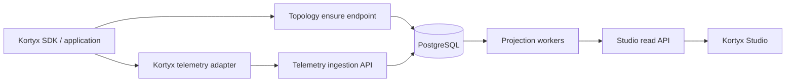

# Kortyx Telemetry → API → Studio implementation plan

## Status and scope

This is the executable plan for replacing Studio fixtures with data emitted by
the public Kortyx SDK on `main` (`kortyx` and `@kortyx/otel`). The SDK already
has run, node, generation, tool, retry, checkpoint, and trace primitives. The
work is to make their lifecycle data durable, correlate it with immutable
workflow topology, and expose read models for Studio.

This plan does **not** write version information back to application source
code. The API owns observed topology revisions. A workflow's existing
`definition.version` remains optional producer-supplied release metadata.

## Handoff context for implementation agents

Start platform work from a feature branch based on `main`, not from the Studio
UI branch. `main` is the SDK source of truth:

| Concern | `main` source location |
| --- | --- |
| Public SDK exports | `packages/kortyx/src/index.ts` |
| Agent configuration and `telemetry.trace` wiring | `packages/agent/src/chat/create-agent.ts` |
| Run lifecycle and trace spans | `packages/agent/src/orchestrator.ts` |
| Node spans, retries, and runtime transition/interrupt mechanics | `packages/runtime/src/graph/create-execution-graph.ts` |
| Trace contracts | `packages/hooks/src/tracing.ts` |
| OpenTelemetry implementation to use as a reference | `packages/otel` |
| Session checkpoints, rollback, and fork lineage | `packages/runtime/src/framework/session-checkpoints.ts` |

There is no `packages/sdk` package on `main`; in this document “SDK” means the
public `kortyx` package and its internal `agent`, `runtime`, `hooks`, and
`stream` packages.

Before writing Phase 1 or Phase 2 production code, the implementation owner
must confirm these decisions. Do not silently invent them:

1. **API home and deployment:** Is the Telemetry API a new application in this
   monorepo, or a separate service/repository? Its package path, runtime, and
   deployment target determine migrations, configuration, and transport.
2. **Authentication bootstrap:** This plan assumes project-scoped API keys.
   Confirm how projects and API keys are created, stored, rotated, and made
   available to SDK users.
3. **Content and retention policy:** Confirm whether any prompt/output, tool,
   interrupt response, error stack, or raw provider payload may be persisted;
   define retention by environment and project.
4. **Delivery guarantee:** Decide the MVP behaviour when the API is unavailable
   (best-effort drop, in-memory bounded retry, durable local outbox, or host
   supplied queue). This cannot be chosen safely by an SDK implementation
   without knowing serverless/container constraints.

Phase 0 is complete only when these four decisions and Contracts A/B are
approved. Phase 1 and Phase 2 can then proceed in parallel using the shared
request/response fixtures in this document.

## Phase 0 decisions adopted

### Service and local deployment

- Create the Telemetry API as `apps/api` in this monorepo.
- Local composition will run three services: `studio`, `api`, and PostgreSQL.
- Docker Compose is a local/development deployment concern; API and SDK
  contracts must not depend on Docker-specific addresses or configuration.

### Project-scoped API keys

Use a conventional split-key format:

```text
ktyx_live_<keyId>_<secret>
ktyx_test_<keyId>_<secret>
```

- `secret` is a cryptographically random 256-bit value and is shown only once.
- Store the key ID and an HMAC-SHA-256 of the secret with a server-held pepper;
  never store the secret itself.
- Each key belongs to one project and has explicit scopes. The initial SDK key
  scope is `telemetry:write` only.
- Studio users authenticate with normal application/session auth and project
  membership; a browser never receives a telemetry write key.
- Environment remains an event/deployment dimension, not a secret or an API
  key scope. The API validates it against the project's allowed environments.

### Topology identity and performance

The topology hash is SHA-256 of a deterministic canonical projection. It is
independent of formatting, object-key order, array order where order has no
meaning, comments, source line changes, tags, descriptions, labels, and all
other display-only metadata.

It changes only when execution topology/behaviour changes:

- workflow ID;
- node IDs;
- edges and edge conditions;
- node run reference when it is a stable string;
- execution-affecting node params (including model/tool settings);
- retry and error behaviour.

Inline function bodies are not hashed. Code-only changes are represented by
`deploymentRef` (Git SHA or image digest), not by a topology revision.

Tags, descriptions, labels, and node display types are stored as mutable
`workflow_display_metadata` keyed by project/environment/workflow. Updating
them refreshes Studio presentation but does not create, mutate, or relink an
immutable topology revision.

Topology reporting must not add request-path latency:

1. Pre-register known workflows asynchronously when the agent starts.
2. Cache the hash/projection per workflow definition in process memory.
3. On a cache miss during a run, emit telemetry with `workflowId` and
   `topologyHash`; resolve it asynchronously and backfill the revision FK in
   the API when the ensure request arrives.

This gives eventual exact correlation without delaying the workflow execution.

### Delivery guarantee

The SDK/API protocol is **at-least-once while the process remains alive**:

- every event has an idempotent `eventId`;
- the adapter batches, retries transient failures with exponential backoff, and
  bounds its in-memory queue;
- the API accepts duplicate events as successful no-ops;
- the SDK never blocks a model response on a retry.

No SDK can guarantee delivery after a process crash without durable local
storage. Durable outbox/queue support is therefore an optional host-supplied
extension, not an SDK default. The API must expose delivery-drop counters so
operators can see loss rather than assume perfect telemetry.

### Content, privacy, and retention

Support full capture, but do not make it the default:

- default: capture IDs, timing, usage, status, errors, provider/model, and
  allowlisted metadata; do not capture prompt/output/tool/interrupt content;
- explicit project and SDK setting: `captureContent: full` captures permitted
  content fields;
- content is encrypted at rest, access-controlled, and retained for a shorter
  configurable period than aggregate telemetry;
- raw provider payloads and error stacks are off by default.

“Capture all” cannot safely be the OSS default because prompts, tool arguments,
and interrupt responses commonly contain customer data or credentials.

### Shared contract package and OpenAPI

Create `packages/telemetry-contracts` as the source of truth for Contracts A
and B:

- Zod schemas and inferred types define wire payloads and Studio API responses;
- API request validation and OpenAPI generation use the same schemas;
- Studio imports generated/OpenAPI client types plus response schemas;
- SDK imports TypeScript types and event-name constants only (`import type`),
  not Zod runtime validation. The API is the authoritative validation boundary.

This avoids duplicated hand-written types without adding meaningful SDK bundle
weight. Contract fixtures live beside the schemas and are run by both SDK and
API tests.

### Time, health, and missing data

- SDK timestamps are ISO-8601 UTC; PostgreSQL uses `timestamptz`; Studio renders
  in the viewer's local timezone and provides exact UTC in detail/tooltip views.
- No observed data means no calculation. Add `unknown` to Studio workflow/node
  health (or make it nullable); never label an unobserved workflow `healthy`.
- `idle` means previously observed but no execution within a configured window.
- `degraded` and `failing` are based on observed failed terminal runs with a
  minimum sample size. Exact thresholds are API configuration and are shown in
  Studio, not hidden constants.



## Ownership and non-negotiable rules

| Owner | Responsibility |
| --- | --- |
| SDK | Report facts observed during execution; report topology definitions; never calculate business cost or mutate source files. |
| Host application | Supply trusted request context (`userId`, `tenantId`) and deployment metadata. Browser-provided values are hints only. |
| Telemetry API | Authenticate, validate, deduplicate, resolve topology revisions, store raw facts, and produce projections. |
| Studio | Read projections. It must not calculate cost, status, percentiles, or topology revisions in the browser. |

Rules:

- API keys resolve `projectId` server-side. Clients do not choose a project.
- Every write is idempotent via an SDK-generated `eventId`.
- Raw events are append-only. Projection rows are replaceable/rebuildable.
- Workflow topology revisions are immutable; runs always retain their original
  `workflowRevisionId`.
- Content capture is opt-in. Prompts, model outputs, tool input/output, and
  interrupt responses are potentially sensitive.

## Contract A — topology registration

### Trigger

The SDK calls `ensureWorkflowTopology` when a workflow is resolved for a run,
including a workflow reached by a transition. It caches the response by
`environment + workflowId + topologyHash`. A startup reconciliation may list
the workflow registry and pre-register all definitions, but first execution is
the correctness backstop.

### SDK → API request

`POST /v1/telemetry/workflow-revisions:ensure`

```ts
type EnsureWorkflowTopologyRequest = {
  schemaVersion: 1;
  environment: string; // Deployment partition: development, staging, production, etc.
  service: {
    name: string; // Application/service that loaded the workflow.
    deploymentRef?: string; // Git SHA, image digest, or CI build reference; not a workflow version.
  };
  workflow: {
    id: string; // Stable logical workflow key from WorkflowDefinition.id.
    declaredVersion: string; // Existing WorkflowDefinition.version; display/release metadata.
    description?: string;
    tags?: string[]; // Convention: WorkflowDefinition.metadata.tags.
    topologyHash: string; // SHA-256 of the canonical projection below.
    nodes: Array<{
      id: string; // Stable node key; graph and metric join key.
      label?: string; // Convention: node.metadata.label; Studio display only.
      type?: string; // Convention: node.metadata.type; Studio visual grouping.
      provider?: string; // Declared default from params.model.provider, if present.
      model?: string; // Declared default from params.model.name, if present.
      metadata?: Record<string, unknown>; // Allowlisted, serializable metadata only.
    }>;
    edges: Array<{
      sourceNodeId: string;
      targetNodeId: string;
      condition?: string; // Workflow edge `when`, if any.
    }>;
  };
};

type EnsureWorkflowTopologyResponse = {
  workflowRevisionId: string; // Immutable API primary key used by all telemetry FKs.
  created: boolean;
};
```

The canonical hash input is the topology projection after deterministic sorting
of nodes, edges, tags, and object keys. It deliberately excludes inline
function bodies: they cannot be reliably serialized. `deploymentRef` records
the code/build that executed the topology.

### API behavior

1. Authenticate the project from the API key.
2. Validate serializability and topology references (all edge endpoints exist).
3. Find or create the immutable revision keyed by
   `projectId + environment + workflow.id + topologyHash`.
4. Store `declaredVersion` as a label, not as the revision identity.
5. Return `workflowRevisionId`.

If the same declared version arrives with a new hash, create a new API revision
and flag it as a version-drift warning. Do not overwrite the previous graph.

## Contract B — execution telemetry ingestion

The existing `ReasonTraceAdapter` remains the SDK's tracing abstraction. Add a
Kortyx adapter that implements it and a small reporter interface for topology
and lifecycle-only events:

```ts
type KortyxTelemetryReporter = {
  ensureWorkflowTopology: (
    snapshot: EnsureWorkflowTopologyRequest,
  ) => Promise<EnsureWorkflowTopologyResponse>;
  emit: (events: TelemetryEvent[]) => Promise<void>;
};
```

The adapter batches events, retries transient failures, and uses an outbox or
bounded local queue where the application runtime permits it. It must not block
token streaming on a best-effort telemetry retry.

`POST /v1/telemetry/events:batch`

```ts
type TelemetryEvent = {
  schemaVersion: 1;
  eventId: string; // UUID/ULID; idempotency key.
  occurredAt: string; // ISO-8601 UTC; when it happened in the SDK.
  environment: string;
  service: { name: string; deploymentRef?: string };
  correlation: {
    traceId?: string;
    spanId?: string;
    parentSpanId?: string;
    runId: string; // Required for all execution events.
    sessionId?: string;
    workflowId: string;
    workflowRevisionId?: string; // Required after topology ensure succeeds.
    topologyHash?: string; // Fallback correlation during a cold-cache/offline retry.
    nodeId?: string;
  };
  context?: {
    userId?: string; // Trusted server identity.
    tenantId?: string; // Trusted server tenant/account identity.
    tags?: string[];
    metadata?: Record<string, unknown>; // Allowlisted application dimensions.
  };
  type: TelemetryEventType;
  payload: Record<string, unknown>;
};

type TelemetryEventType =
  | "span.started"
  | "span.ended"
  | "span.failed"
  | "generation.completed"
  | "tool.started"
  | "tool.completed"
  | "tool.failed"
  | "interrupt.created"
  | "interrupt.resolved"
  | "interrupt.expired"
  | "interrupt.cancelled"
  | "run.cancelled"
  | "workflow.transitioned"
  | "session.checkpointed"
  | "session.forked"
  | "session.rolled_back";
```

### Event payloads and their purpose

| Event | Required payload fields | Purpose in Studio |
| --- | --- | --- |
| `span.started` | `name` (`kortyx.run`, `kortyx.node`, `useReason`, etc.), `attributes` | Starts run/node timing and preserves trace hierarchy. |
| `span.ended` | `name`, `attributes`, `durationMs` | Closes successful spans; provides timing and terminal state. |
| `span.failed` | `name`, `error: { message, name?, stack? }`, `durationMs` | Produces failed runs/nodes and `latestError`; stack storage is restricted. |
| `generation.completed` | `provider`, `model`, `usage: { input?, output?, total?, reasoning?, cacheRead?, cacheWrite? }`, `finishReason?`, `warnings?` | Source of observed model/provider, tokens, cost, and model analytics. |
| `tool.started/completed/failed` | `tool`, `toolCallId`, `durationMs?`, `isError?` | Produces actual tool usage, tool timeline, and tool failure metrics. |
| `interrupt.created` | `interruptId`, `requestId`, `resumeToken` (encrypted or omitted from read models), `kind`, `question?`, `optionCount?`, `nodeId`, `expiresAt?` | Creates the Studio pending interrupt record. |
| `interrupt.resolved` | `interruptId`, `resolvedAt`, `response?`, `resolvedBy?`, `resumeOutcome`, `resumeError?` | Closes interrupt and records audit/resume outcome. |
| `interrupt.expired/cancelled` | `interruptId`, `occurredAt`, `reason?` | Prevents a TTL deletion from erasing interrupt history. |
| `run.cancelled` | `reason?`, `cancelledBy?` | Makes `cancelled` explicit; never infer it from a disconnect. |
| `workflow.transitioned` | `sourceNodeId`, `sourceWorkflowRevisionId`, `targetWorkflowId`, `targetWorkflowRevisionId`, `condition?`, `intent?` | Builds cross-workflow graph edges and transition metrics. |
| `session.checkpointed` | `checkpointId`, `turnIndex`, `parentCheckpointId?`, `workflowRevisionId`, `nodes[]` | Supports session checkpoint counts and audit/timeline views. |
| `session.forked` | `newSessionId`, `parentSessionId`, `forkedFromCheckpointId` | Supplies the real `hasFork`/lineage concept. |
| `session.rolled_back` | `checkpointId`, `invalidatedCheckpointIds?`, `invalidatedInterruptIds?` | Keeps history coherent after rollback. |

## SDK implementation work

The following items are additions to `main`; they are not a new raw telemetry
framework.

1. Add `telemetry.reporter` to the agent/runtime configuration alongside the
   existing `telemetry.trace` adapter.
2. When the workflow registry selects a workflow, project it, hash it, call
   `ensureWorkflowTopology`, cache the returned revision, and place that ID in
   runtime context.
3. Enrich run, node, `useReason`, generation, and tool telemetry with
   `runId`, `sessionId`, `workflowId`, `workflowRevisionId`, and `nodeId` where
   applicable. Existing spans already cover most of this data.
4. Emit lifecycle events for generic interrupts, cancellation, transitions,
   checkpoints, forks, and rollbacks. In particular, transitions need the
   source node; cancellation and expiry must be explicit.
5. Pass the workflow declared version and deployment reference into session
   checkpoint records, which already have fields for them.
6. Implement `createKortyxTelemetryAdapter`. It maps existing trace callbacks
   and the reporter calls to Contract B; it is allowed to coexist with the
   OpenTelemetry adapter.
7. Add contract tests: idempotent topology ensure, event order, retries,
   offline replay, no untrusted identity overwrite, and no content emission
   when capture is disabled.

## API feeding path

### Database initialization

Use PostgreSQL with **Drizzle**. Telemetry ingestion and projection work is
PostgreSQL-heavy: idempotent bulk inserts, `ON CONFLICT` handling, JSONB,
CTEs, outbox writes, percentile/window queries, and backfills. Drizzle keeps
those queries SQL-first while retaining TypeScript schema and result types.
Do not introduce Prisma for this API.

Initial tables, independent of ORM:

| Table group | Purpose |
| --- | --- |
| `projects`, `api_keys`, `environments`, `deployments` | Authentication, tenancy, and deployment provenance. |
| `workflows`, `workflow_revisions`, `workflow_nodes`, `workflow_edges` | Immutable topology snapshots. |
| `telemetry_events` | Append-only, deduplicated source record; retain raw JSON payload with PII policy. |
| `spans`, `generation_calls`, `tool_calls` | Queryable normalized execution facts. |
| `runs`, `run_nodes`, `sessions`, `interrupts`, `session_checkpoints`, `session_forks` | Studio-serving lifecycle projections. |
| `pricing_rate_cards`, `pricing_rules`, `cost_line_items` | Versioned pricing and auditable estimated cost. |
| `workflow_metric_rollups`, `node_metric_rollups`, `transition_metric_rollups` | Precomputed Studio metrics by time window. |

### Ingestion sequence

1. Authenticate the API key and resolve `projectId`.
2. Validate payload against Contract B and schema version.
3. Insert raw events with unique `(projectId, eventId)`; duplicate inserts are
   successful no-ops.
4. Resolve workflow revision from `workflowRevisionId`, or from
   `workflowId + topologyHash` only if that revision is already registered.
5. Write normalized facts in the same transaction or through an outbox.
6. Schedule projection updates; acknowledge ingestion only after the raw event
   is durable.

Unknown model pricing, unsupported payload fields, and projection failures do
not reject an otherwise valid raw event. Store the fact and mark the relevant
projection as pending/unpriced.

## API consuming path — converting facts into Studio data

Studio reads REST/tRPC/query endpoints backed by projections, never raw spans.

### Run projection

| Studio field | Source / conversion | Purpose |
| --- | --- | --- |
| `id` | `runId` | Stable run detail and correlation key. |
| `status` | Open run = `running`; failed root span = `failed`; `run.cancelled` = `cancelled`; open interrupt/awaiting input = `interrupted`; otherwise closed root span = `completed`. | Accurate state/filtering. |
| `startedAt`, `duration` | Run-span start/end; `started` is formatted in Studio, never stored as “12s ago”. | Timeline and sorting. |
| `workflow`, `version` | Joined workflow revision; use logical workflow ID and declared version/revision label. | Historical topology context. |
| `path` | Ordered executed node spans. | Actual path, not static graph order. |
| `session` | `sessionId`. | Session drill-down. |
| `model`, `models`, `provider` | Observed generation calls; define `model/provider` as last call and `models` as distinct count. | Compact UI plus multi-model disclosure. |
| `tokens` | Sum `usage.total`; fallback to `input + output` only if total is absent. | Usage filtering and reporting. |
| `cost` | Sum `cost_line_items`. | Versioned estimated cost. |
| `result`, `latestError` | Captured output if policy allows; otherwise safe final summary. Errors come from failed spans. | Human diagnosis without accidental content exposure. |
| `hasTool`, `hasRetry`, `interruptNode` | Tool-call existence; node attempt > 1; active interrupt node. | Operational filters. |

### Cost projection

For every `generation.completed` event, match the provider/model and event time
to one active pricing rule. Generate one immutable cost line item:

```text
inputTokens    × inputTokenRate
outputTokens   × outputTokenRate
reasoningTokens × reasoningTokenRate
cacheReadTokens × cacheReadTokenRate
cacheWriteTokens × cacheWriteTokenRate
= estimated cost
```

Store `pricingRuleId`, currency, quantity breakdown, and computed amount. A
missing exact rule yields `pricingStatus = unpriced` and no cost amount; it must
not fall back to a different model or display zero.

### Session projection

Group by `sessionId`:

- `runs`, `succeeded`, `failed`, `interrupted`: terminal run status counts.
- `lastActivityAt`: latest received execution or lifecycle event timestamp.
- `duration`, `tokens`, `cost`: sums across closed runs. If a wall-clock
  session duration is later needed, add a separate field; do not overload this
  cumulative duration.
- `providers`, `models`: distinct observed generation dimensions.
- `checkpoints`, `hasFork`: checkpoint and fork lifecycle records.
- `latestResult`, `latestError`, `pendingInterrupt`: newest matching run or
  open interrupt.

### Workflow and node projections

- Topology comes only from `workflow_revisions`, nodes, and edges.
- `runCount` is the number of runs in a selected time window.
- `successRate = completed / (completed + failed)`; cancelled and interrupted
  are reported separately and excluded from this ratio.
- `errorRate = failed / (completed + failed)`.
- `interruptRate = runs with one or more interrupt.created / all runs`.
- `retryCount = count(node executions where attempt > 1)`.
- `p50DurationMs` and `p95DurationMs` are percentiles over completed run/node
  durations in the selected window.
- `averageTokens` and `averageCost` are arithmetic means over executions with
  known values; report coverage separately when unpriced runs exist.
- Transitions aggregate `workflow.transitioned` by source and target revision.

Workflow health is a configurable Studio/API policy, for example: `idle` when
there are no runs within seven days; `failing` above a high error threshold;
`degraded` above a lower error or p95-SLO threshold; otherwise `healthy`.

### Studio read endpoints

Minimum read contract:

| Endpoint | Consumer |
| --- | --- |
| `GET /v1/studio/runs` and `GET /v1/studio/runs/:id` | Runs list/detail and filters. |
| `GET /v1/studio/sessions` and `GET /v1/studio/sessions/:id` | Session list/detail. |
| `GET /v1/studio/interrupts` | Pending/history interrupt views and actions. |
| `GET /v1/studio/workflows?window=...` | Topology plus workflow/node/transition metrics. |
| `GET /v1/studio/catalogs` | Providers, environments, workflow tags, model values for filters. |

The API response schemas should replace Studio's fixture schemas one-for-one,
with these corrections:

- provider must be a string/catalog value, not a fixed OpenAI/Anthropic/Google
  enum;
- timestamps must be ISO timestamps; relative labels are presentation only;
- cost must be nullable and accompanied by pricing status where relevant;
- workflow revision identity must be available for detail views and debugging.

## Delivery sequence and acceptance criteria

### Phase 0 — contract lock

- Approve Contracts A and B, content-capture policy, retention policy, and
  status/health definitions.
- Acceptance: SDK and API teams can produce/validate shared contract fixtures.

### Phase 1 — topology and database foundation

- Initialize PostgreSQL, migrations, auth/project/environment tables, and
  topology tables.
- Implement `workflow-revisions:ensure` with canonical hashing and idempotency.
- Acceptance: identical snapshot returns one revision; changed topology creates
  a second immutable revision; old revision remains queryable.

### Phase 2 — SDK reporter and adapter

- Add reporter lifecycle hooks and `createKortyxTelemetryAdapter`.
- Add topology resolution/cache; inject `workflowRevisionId` into telemetry.
- Add missing interrupt/cancel/transition/checkpoint/fork/rollback events.
- Acceptance: a sample application emits one correlated run tree and one
  topology revision without a CLI or source-code mutation.

### Phase 3 — ingestion and raw facts

- Implement authenticated batched ingestion, idempotency, outbox, normalized
  spans/generation/tool facts, and failure monitoring.
- Acceptance: duplicate delivery changes no counts; out-of-order end events
  converge; raw data can replay into an empty projection database.

### Phase 4 — projectors and pricing

- Build run, session, interrupt, topology metric, transition, and cost
  projectors.
- Seed a versioned rate card and expose unpriced coverage.
- Acceptance: fixture events produce deterministic Studio-compatible rows and
  auditable cost line items.

### Phase 5 — Studio integration

- Replace mock loaders with Studio API clients, server-side filtering,
  pagination, and loading/error states.
- Update schemas for generic providers, ISO timestamps, nullable pricing, and
  revision-aware details.
- Acceptance: Runs, Sessions, Interrupts, and Workflows pages render solely
  from the API for a seeded project.

### Phase 6 — rollout and operations

- Add feature flag, telemetry delivery metrics, dead-letter/replay tooling,
  retention jobs, and permission checks for captured content.
- Run dual-write/fixture comparison before removing mocks.
- Acceptance: production telemetry loss/error rate and projector lag have
  dashboards and alerts; a replay can rebuild all Studio projections.
