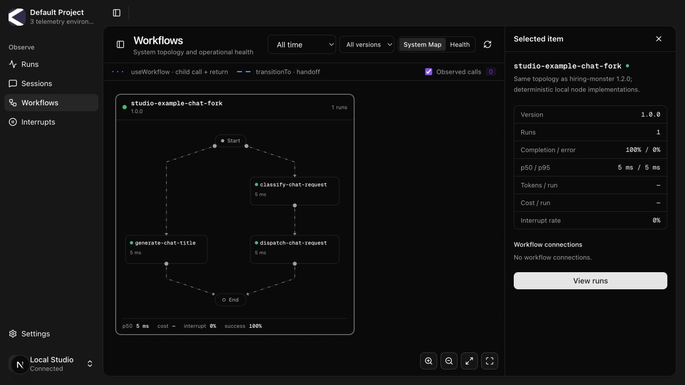
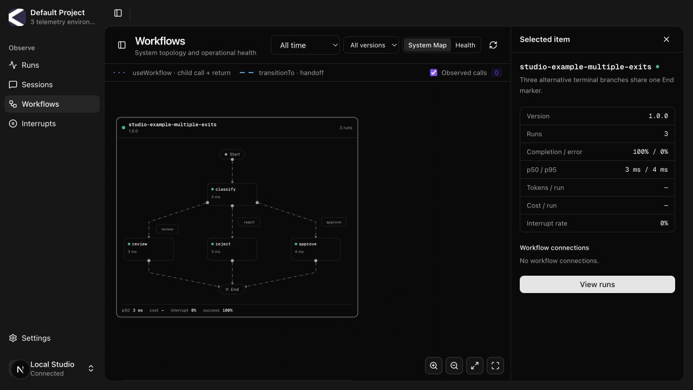
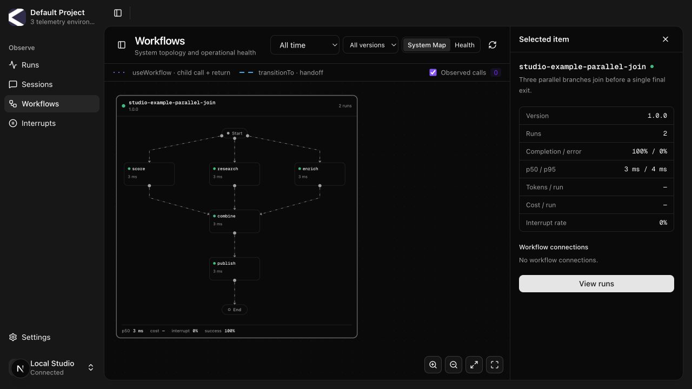
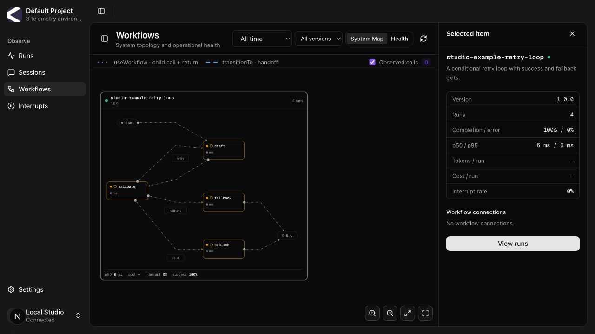
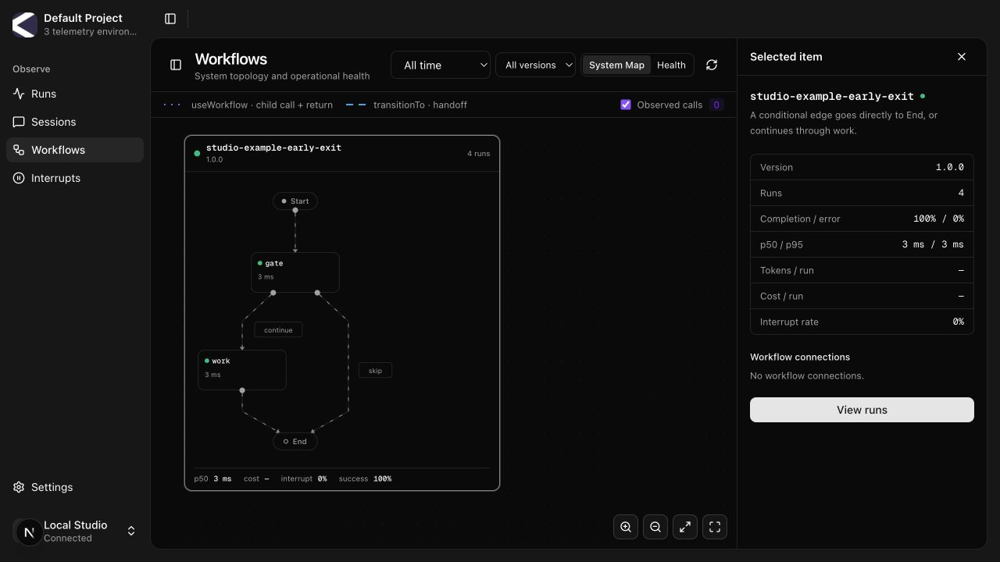
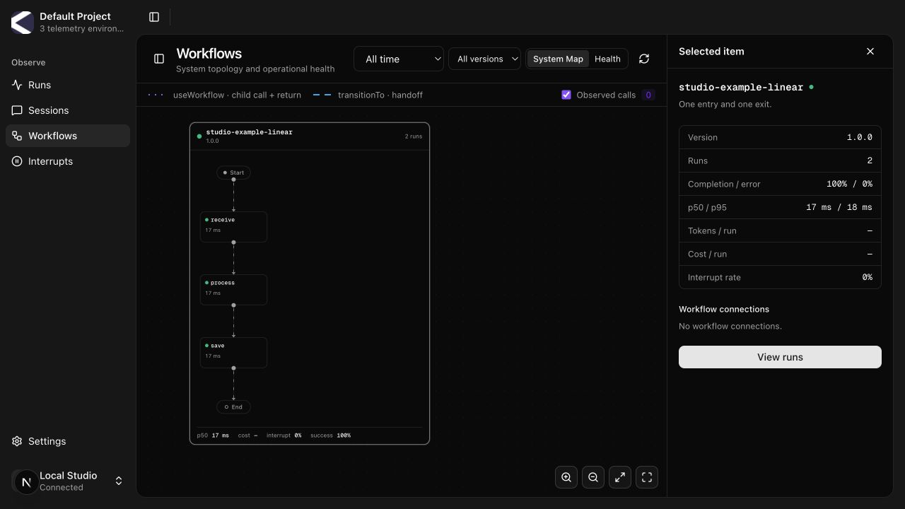
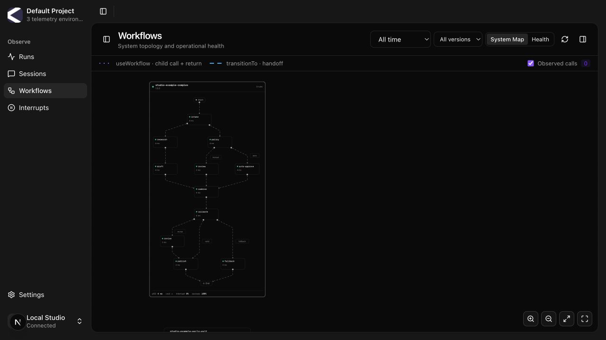

# Studio workflow boundaries: local verification

Studio now renders the catalog's `__start__` and `__end__` endpoints as compact
Start/End markers. Previously those endpoints had edges but no React Flow nodes,
so React Flow omitted their edges. The title branch in `hiring-monster@1.2.0`
therefore appeared disconnected even though its runtime definition was correct.

The markers participate in layout, routing, obstacle avoidance and label
placement. They have no execution metrics or node inspector. Multiple terminal
nodes connect to one shared End; no runtime topology or API contract changes.

Verified on 2026-09-18 using an isolated checkout, local API on `127.0.0.1:6401`,
Studio on `127.0.0.1:6301`, and a dedicated Docker PostgreSQL instance. The example
catalog was published with `kortyx topology push`. The example runner executed
thirteen scenarios through `agent.execute` with the real telemetry adapter; all
completed. The node implementations are deterministic and make no model calls.
These screenshots show the actual Studio UI reading the resulting catalog and
projected runs. Repeated verification runs account for counts above one scenario
set in the screenshots.

| Workflow | Execution scenarios | Rendered edges |
| --- | --- | --- |
| `studio-example-linear` | Receive → process → save | 4 |
| `studio-example-chat-fork` | Title generation alongside classification/dispatch | 5 |
| `studio-example-multiple-exits` | Approve, reject, review | 7 |
| `studio-example-parallel-join` | Three branches → combine → publish | 8 |
| `studio-example-retry-loop` | Retry once, then success or fallback | 7 |
| `studio-example-early-exit` | Skip directly to End, or continue through work | 4 |
| `studio-example-complex` | Manual approval/revision, automatic approval, fallback | 16 |

Browser inspection confirmed all 51 internal edges render and each workflow has
exactly one Start and one End. Clicking a boundary preserves workflow selection.
Both horizontal and vertical layouts are represented. The larger graph needs
zoom/pan to inspect individual nodes at the default browser viewport. The
sequential retry graph is separate because the runtime disallows back-edges in
parallel graphs.

Reproduction commands are in the [Canvas README](../../examples/kortyx-canvas/README.md#studio-workflow-layout-examples).

## Title/classification fork

Same declared topology as `hiring-monster@1.2.0`.

## Multiple terminal branches

## Parallel join

## Sequential retry loop

## Direct conditional exit

## Linear workflow

## Larger combined workflow

