# Studio prompts verification

Verified against the production Studio build on 2026-10-08. All data shown is a local test fixture.

## Automated checks

- Root `pnpm build`: 32 successful tasks.
- Root `pnpm type-check`: 51 successful tasks.
- Root `pnpm coverage`: 39 successful tasks; existing coverage gates preserved.
- Root `pnpm lint`, dependency audit and `git diff --check`: passed.
- Studio: 244 tests passed, plus production/development auth-adapter smoke checks.
- API: 114 tests passed (2 unrelated optional tests skipped), plus real production/development security-adapter checks.
- Telemetry database: 198 tests passed against PostgreSQL, including fresh migration, tenant isolation, immutable versions, category/group mutations, promotion evidence and independent destination transfer.
- Website: 20 tests passed and 418 documentation routes built.
- Example application: authenticated transport tests passed against both source and destination deployments.
- Kortyx skill: metadata validation passed.

## Manual application and CLI checks

Ran two independent PostgreSQL/API deployments and two copies of the runnable prompt example. Created a system/user prompt, reviewed and saved a candidate with changed instructions and configuration, launched a complete suite from a test group, and launched one selected case directly against the candidate without a group. Attached evaluations correctly distinguished complete and selected tests and verified actual prompt usage.

After integrating the latest multi-suite evaluation flow, repeated the individual-case and full-suite group launches successfully. Regression checks confirm every child suite shares the same frozen baseline and retries retain it after group changes.

Promoted the tested candidate through Studio. A new application request resolved its exact version/hash from production, recorded generation provenance and kept the private prompt snapshot out of the public response.

Exercised CLI create/read/validate/update/diff/archive/restore/export and authenticated cross-deployment plan/apply. Read destination versions back to verify hashes; repeated the same transfer without duplicate writes; ran destination evaluations before destination promotion. Imported a CLI bundle through the Studio file picker and confirmed its destination hash and unassigned state.

Exercised nested category creation, rename, reparenting, bulk movement and group membership. Browser Back/Forward restored tab and launch state. Reviewed required change notes, promotion readiness, audited-exception controls and archived/read-only restrictions.

The example uses a deterministic provider and app judge for these integration checks. This verifies serving, execution, evaluation and migration behavior; it does not establish a live provider model’s semantic quality. Optional real-model configuration is documented in the example.

## Visual review

Inspected the real React UI in light and dark themes at 1440×1000, 768×1024 and 390×844. Checked library/category navigation, detail headers, history menus, comparison and save-review dialogs, group/eval/import drawers and promotion controls. Fixed narrow-header wrapping, diff footer wrapping and read-only format contrast. Tablet and mobile document widths matched their viewports; wide tables scroll inside their containers. Restored the original theme and viewport after testing.

### Drawer and table follow-up

Replaced the history sidebar with a version dropdown whenever the prompt's available content width is below 896px, including small drawers on wide screens. Wide prompt views retain the sidebar. Removed the prompt table's redundant bordered, rounded shell.

Reproduced and fixed nested editors covering parent content, menu typeahead expanding a route drawer, Escape dismissing both a menu/dialog and its parent, and loss of the Groups list ancestor when opening Group → Prompt. Prompt and group action panels now participate in browser Back/Forward; category list history correctly closes and restores prompt drawers.

The production build passed **31 browser checks** spanning the existing drawer-stack and responsive suites plus nine new prompt regressions and fixture setup/cleanup. The prompt suite also passed all **11 development checks** including setup/cleanup. Studio's **244 unit tests**, type checking and the production build passed after these changes. The new prompt regressions run in both development and production CI jobs.

Manually reviewed the final production UI on desktop, 768×1024 tablet and 390×844 mobile. Confirmed full-width message fields beside the compact selector, wrapped change notes inside its menu, and space reserved beside desktop inspectors. Temporary viewport overrides were reset after review.

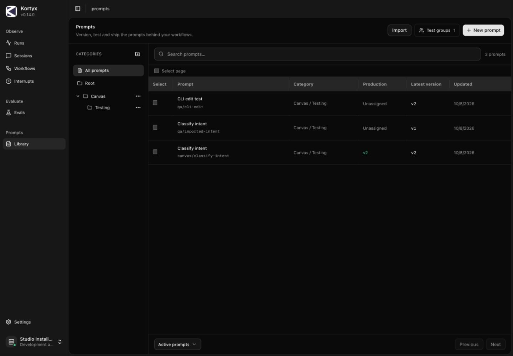

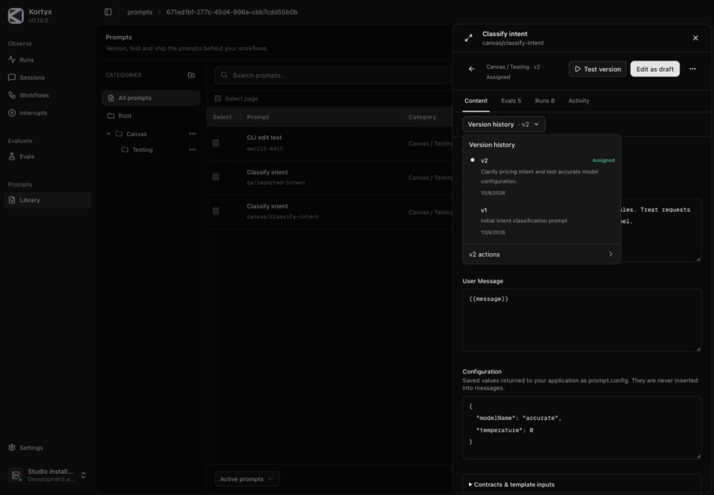

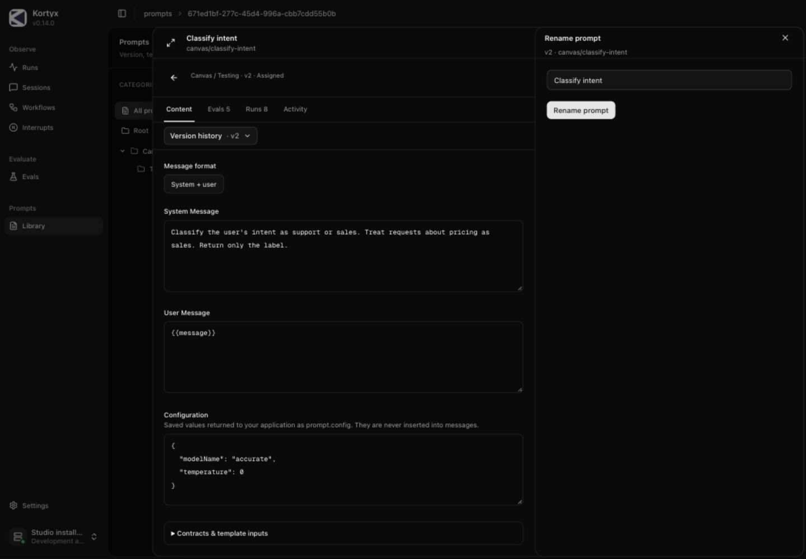

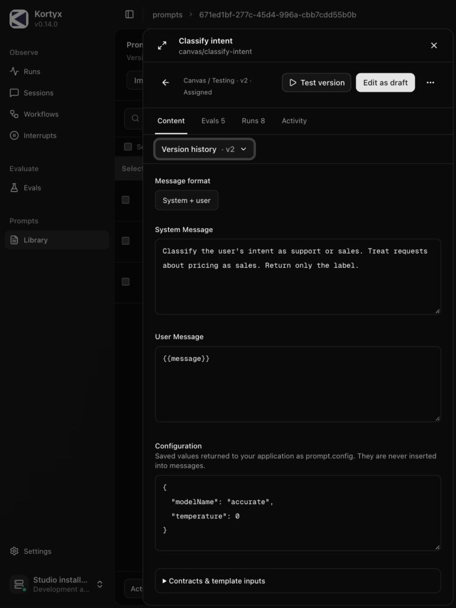

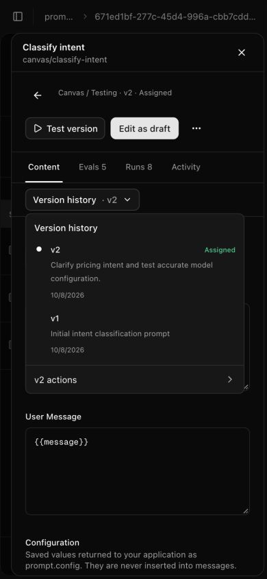

### Desktop version comparison

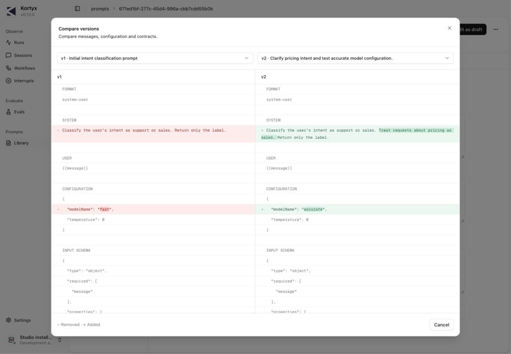

### Tablet prompt content

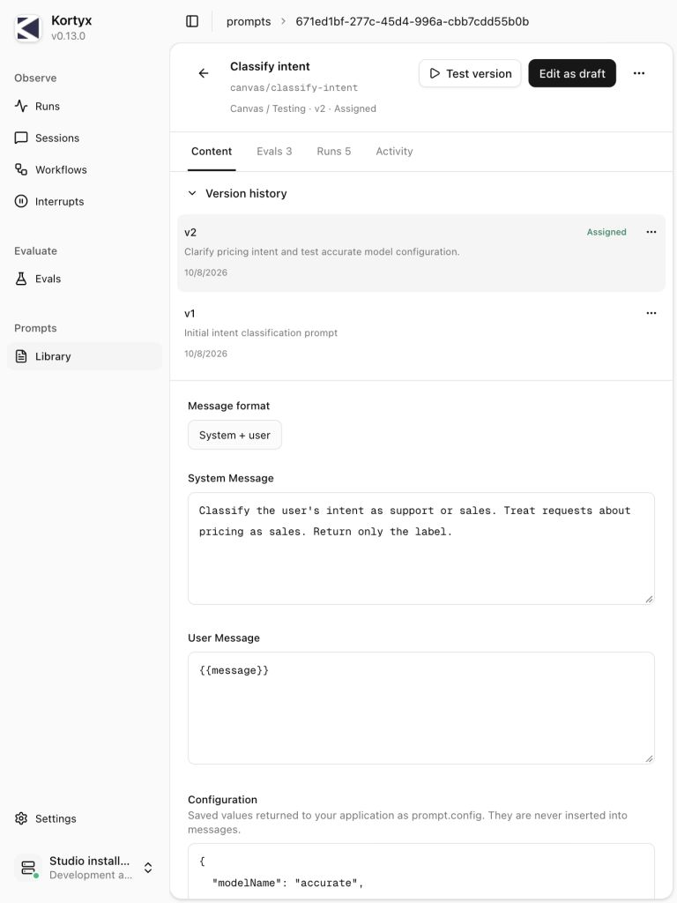

### Mobile attached evaluations

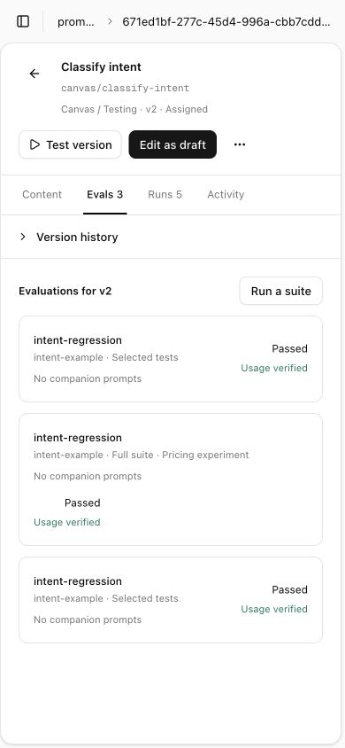

### Mobile individual-case launch

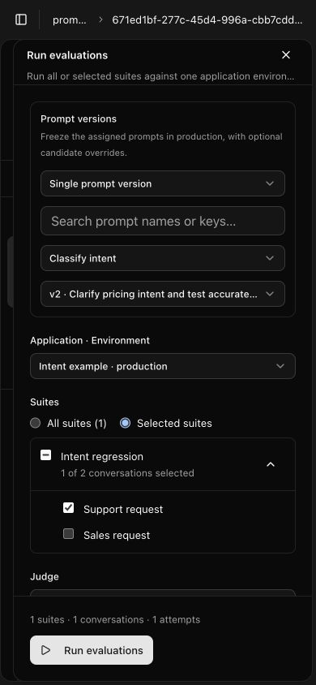

### Mobile save review

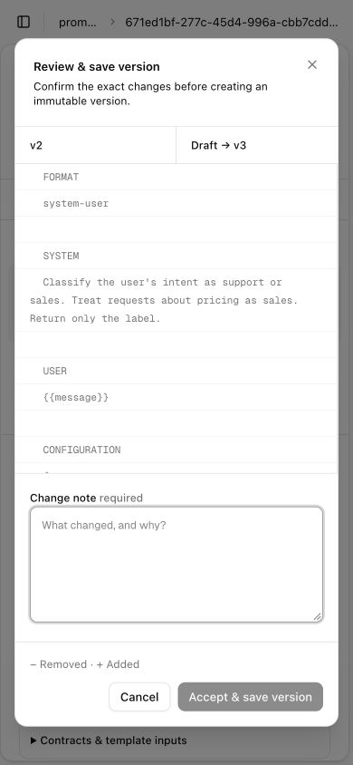

### Prompt editor and composition follow-up

Replaced message textareas with TipTap's native plain-text document, Mention and
Suggestion extensions. System and user fields occupy the available width; the
redundant message-format selector is removed. Template inputs are blue and
included prompt chips are violet. Additional chat messages remain available
through the message controls.

Verified exact-version selection and Latest through keyboard and mouse,
including picker dismissal without closing the prompt drawer. Latest pins the
selected saved version. Saved content persists stable-key tokens and exact
version/hash dependencies, rather than editable display names. Recursive
expansion preserves message roles and the parent's configuration. Invalid input
contracts, missing roles, cycles and oversized expansion are rejected.

The SDK compilation tests, real workflow evaluation test and PostgreSQL
integration checks verify expanded instructions, immutable dependency pins, and
parent/child usage receipts. Manual CLI create/read/export and independent
source-to-destination plan/apply/read-back verified renamed inline tokens and
dependency manifests; retrying the plan produced no duplicate versions. The
destination SDK resolved the rewritten parent and expanded the renamed child.
A separately registered example using the composed prompt passed a full suite
and one selected case through the CLI, with exact parent/child receipts and
attached evaluations/runs visible on both prompts. The Studio run drawer also
launched the composed candidate successfully, with 2/2 passing attempts.

The final combined drawer, prompt and responsive run passed all 35 checks in
production and development (33 scenarios plus fixture setup/cleanup). The native
prompt suite contributes twelve scenarios. Responsive locators assert displayed
surfaces while Next briefly retains hidden streamed markup.
Repository type checking passed all 51 tasks; prompt coverage passed its gates
with 19 tests. Studio's 244 unit tests and the production build passed.

Inspected the production editor and native inclusion menu on desktop, tablet
and mobile, then restored the browser viewport.

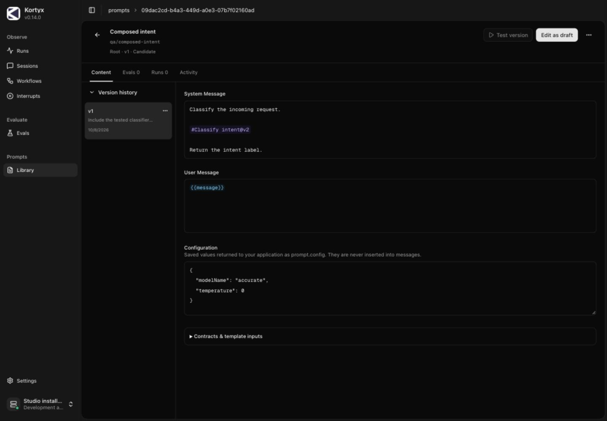

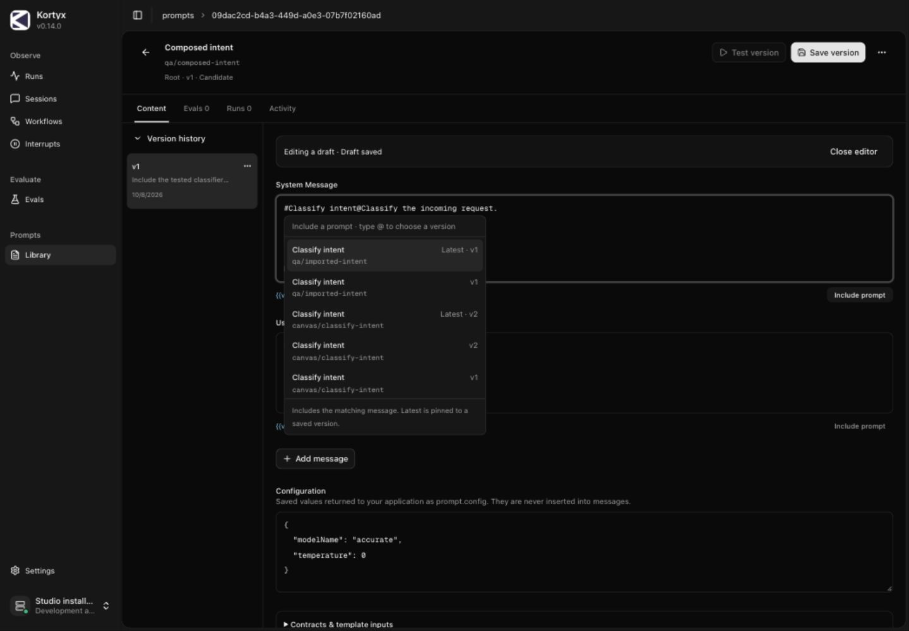

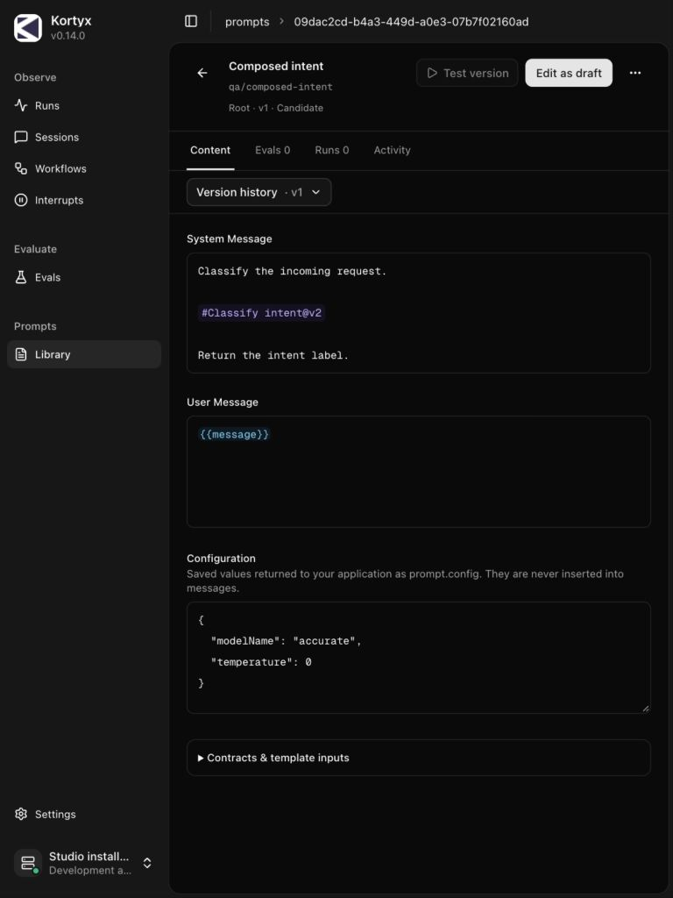

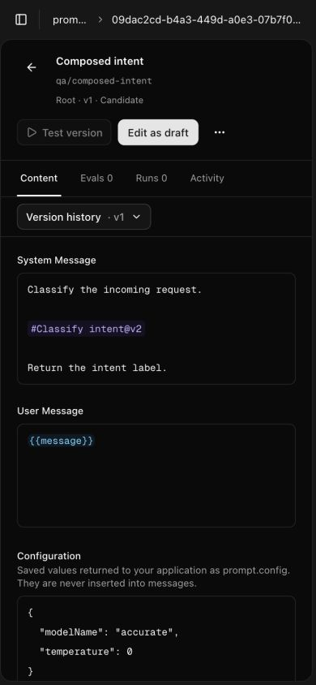

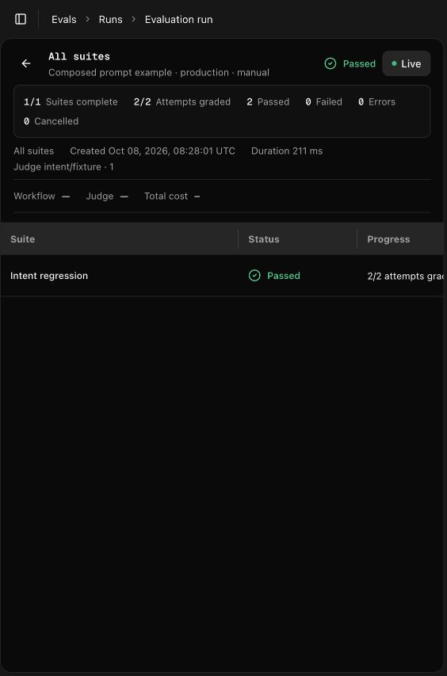

### First-frame drawer keyboard regression

Stress tests reproduced an intermittent Escape failure while revisiting
Run → Session → Run. Instrumentation showed the key reached the window without
a drawer listener installed. Keyboard ownership now updates in a layout effect,
in the same commit as the active surface. A new browser regression dispatches
Escape from the transition's DOM mutation microtask; it failed before the fix
and passed three consecutive development runs afterward. The existing native
Escape, nested inspector, menu and TipTap picker scenarios remain in the suite.

The CI shard also exercised Escape before Next had committed the new pathname.
Dismissal now waits for that route commit; newer navigation or browser history
cancels it. The first-frame and responsive checks passed three repeated
development runs. Responsive assertions target displayed content while retaining
all geometry checks, avoiding Next's transient hidden streamed copies.

Native undo/redo restores exact version/hash attributes on prompt mention nodes
and reconciles the dependency manifest. The regression deletes an included
prompt, undoes/redoes the deletion, then saves and verifies its immutable pin.
The final production build, Studio type check, repository lint, whitespace check
and all 244 Studio unit tests passed after these fixes.

### Full-area Runs and Evals tables

Prompt Runs and Evals tabs reuse the canonical run mapping and evaluation
columns. Version history stays in a compact dropdown on these tabs; the flat
table fills the available width and height, including its empty state, with
pagination anchored at the bottom. Search, status filtering, sorting, column
controls and row navigation use the platform components. Table query state is
isolated from the destination detail's query state.

Runs are deduplicated by execution ID; multiple generation receipts produce one
row. Multi-suite launches appear as one evaluation row with canonical progress,
results, application, trigger, cost and duration. Prompt usage remains visible
and includes suite selection, test groups and companion versions in its details.
The scoped API returns canonical rows for the selected version, preserving
legacy suite links and enforcing project/environment permissions.

New regressions exercise actual populated database rows, duplicate receipts,
Run drawer nesting/restoration, eval navigation, and full-area empty tables at
1440px, 768px and 390px. API integration checks cover evaluation grouping,
empty run selection, invalid versions and serve-only authorization.

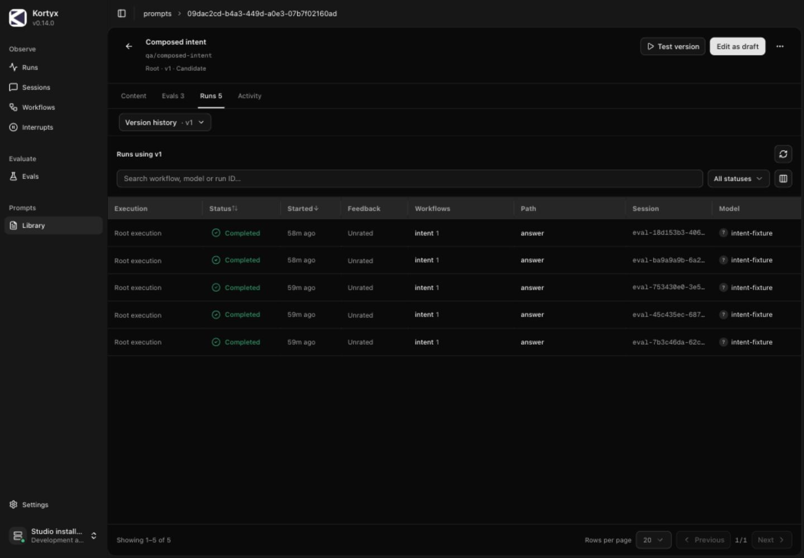

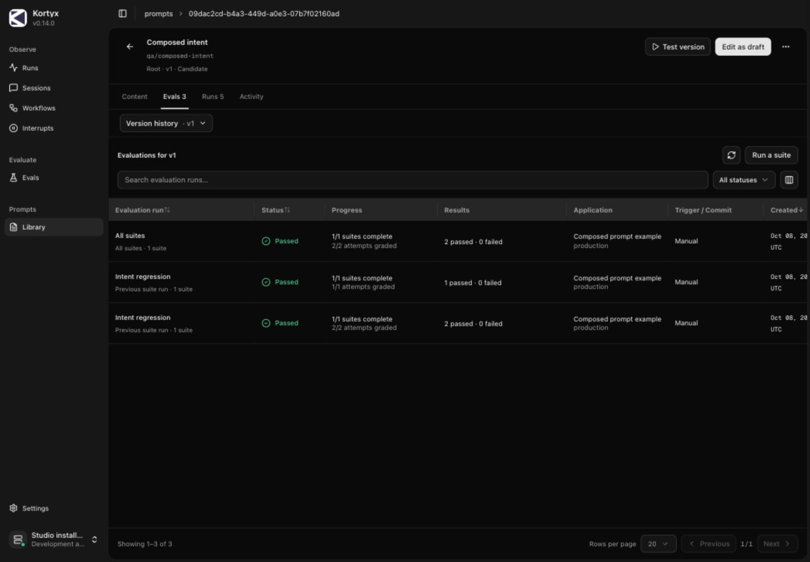

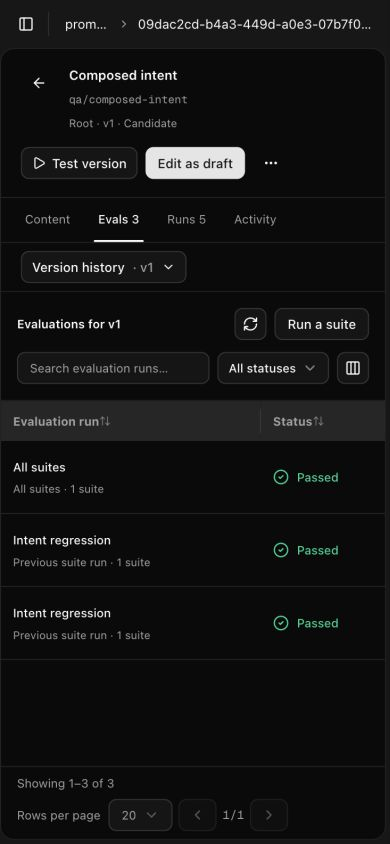

Final validation after this change: **41 browser checks passed in development
and 41 in production** (39 scenarios plus fixture setup/cleanup), including
all evaluation launch, drawer-stack, prompt and responsive scenarios. All
**244 Studio unit tests**, the PostgreSQL-backed prompt API integration test,
**51/51 root typecheck tasks**, repository lint, API build and production
Studio build passed. The local API was restored to the example application
targets after the fixture-based checks.

### Inspector close-button alignment

The shared inspector header now centers its close button beside the complete
title/subtitle block, matching the main detail drawer. It retains the native
button, accessible label and dismissal behavior. The geometry regression
reproduced a 9.5px upward offset in the previous production build and now
checks alignment, header overflow and repeated dismissal at desktop, tablet
and mobile widths. The production promotion panel was visually reviewed at
1440px and 390px.

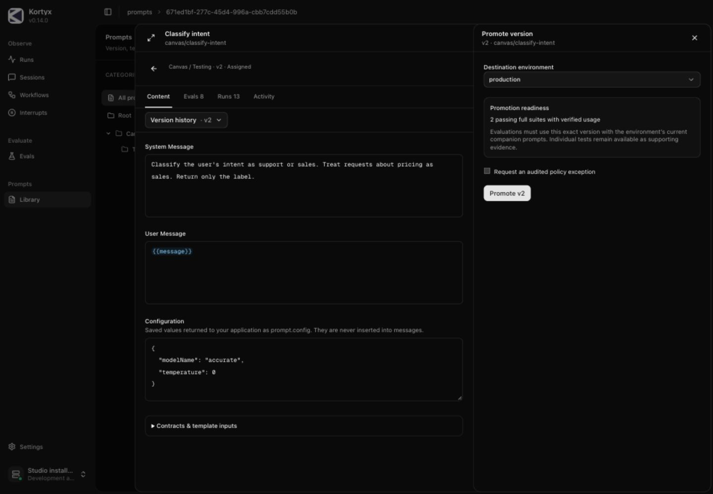

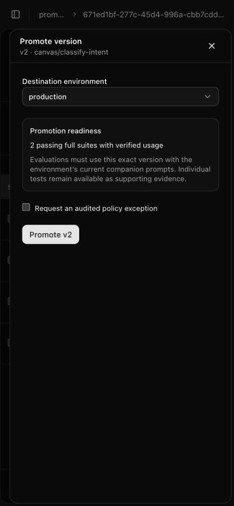

After the header fix, **37 drawer/prompt/responsive browser checks passed
in development and 37 in production**. Studio typecheck, repository lint
and the production Studio build also passed. The regression fails against
the previous production header and passes with the shared alignment fix.

### Cancel editing (2026-10-09)

The editor now exposes **Cancel** beside **Save version**, and the entry action
is simply **Edit** in both the header and version menu. Cancel closes an unchanged
draft directly. Changed or invalid fields open the platform confirmation dialog
with **Keep editing** focused by default and an explicit **Discard changes**
action. Escape dismisses the confirmation while preserving the editor.

Confirmed discard clears the shared autosaved draft without creating a version
or changing assignments. It waits for an in-flight autosave, cancels queued saves,
and uses a revision check to preserve another editor's newer draft. Database
regressions cover stale discard, tenant isolation, stale autosave after discard,
and repeated clean cancellation. Browser regressions cover clean/dirty/invalid
fields, keeping edits, Escape, reload and the delayed-autosave race.

Reviewed the live UI at 1440×1000 and 390×844. The unavailable Test version action
is hidden during editing so the mobile action row remains compact.

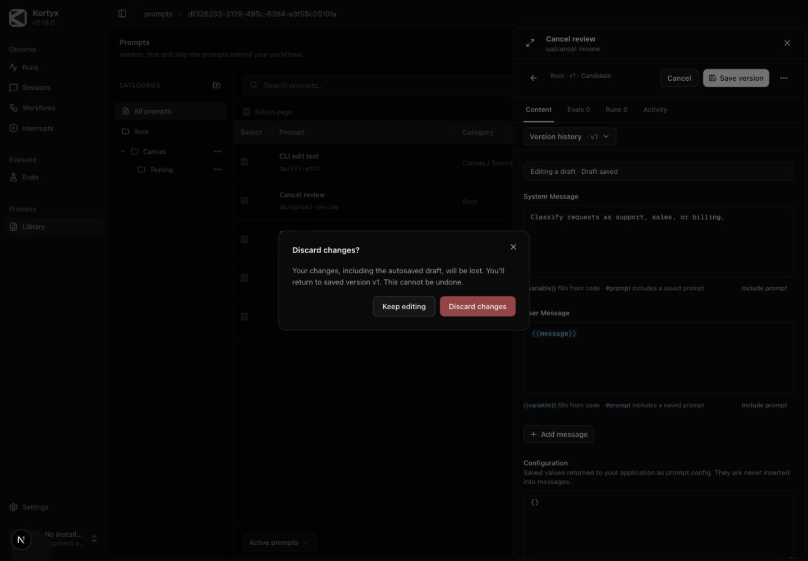

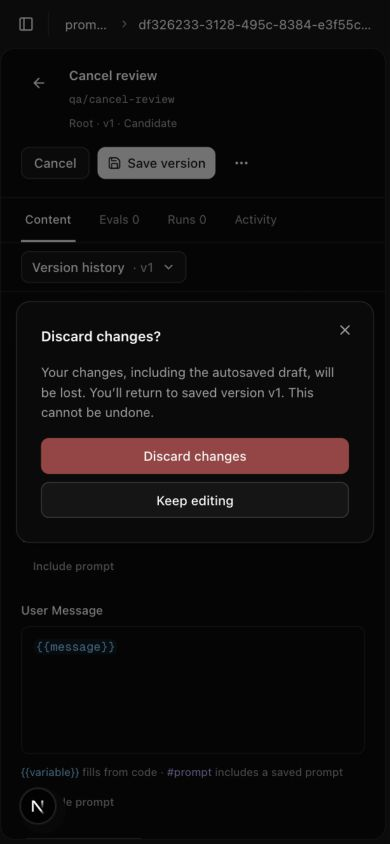

Integrated current main's diagnostics and eval attempt scheduling. The prompt
migration now follows diagnostics as `0009_prompt_management.sql`; fresh native
migration and Drizzle schema comparison pass. Root typecheck (51 tasks), repository
lint, the API/SDK and production Studio builds, 252 Studio unit tests, prompt API
and database integration, and 17 eval execution integration tests passed. The CLI
loader regression passed independently after an initial resource-contention timeout.

### JSON configuration editors (2026-10-09)

Configuration, template input schema and configuration schema now use CodeMirror's
native JSON language and editor extensions. Keys, strings, numbers and literals
have distinct colors in both themes. Line numbers, folding, bracket matching,
indentation, native undo/redo and parse-error markers remain available without
changing stored JSON. Format applies two-space indentation; invalid objects block
saving, and Tab retains normal form navigation. Read-only versions retain colors.

The browser regression checks distinct token colors, formatting and undo/redo,
keyboard exit, invalid-input feedback, all three JSON fields, width containment at
1440/768/390px, and a save/reload round trip preserving value types. Both Cancel
regressions pass with CodeMirror, including invalid JSON and an in-flight autosave.
Manually reviewed light/dark desktop and mobile layouts and saved the disposable
QA prompt through the diff dialog. The production build, Studio typecheck, all
252 Studio unit tests, repository lint and production dependency audit pass.
The final production drawer/prompt/responsive run passed **40 checks**; the
development prompt/responsive run passed **22 checks** (including fixture
setup/cleanup).

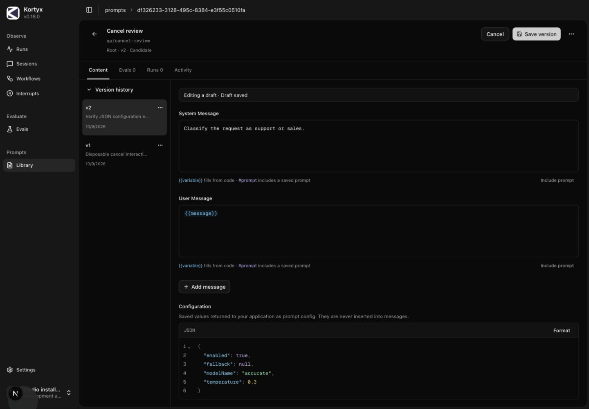

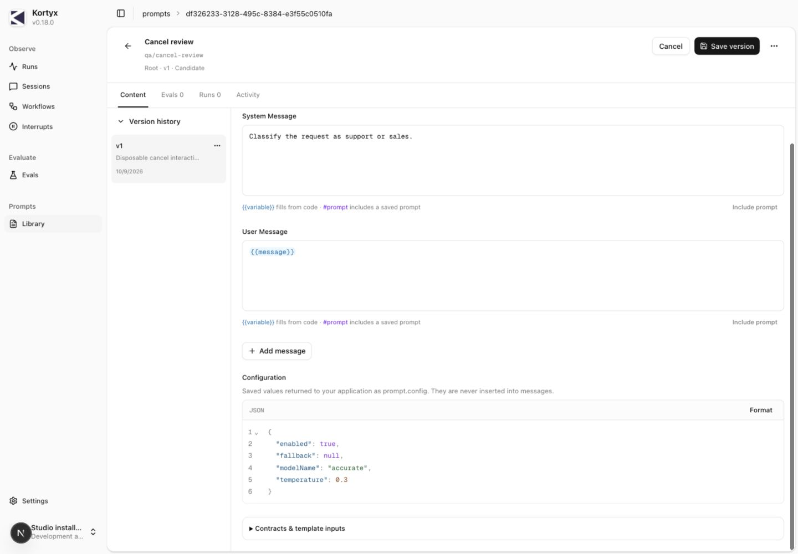

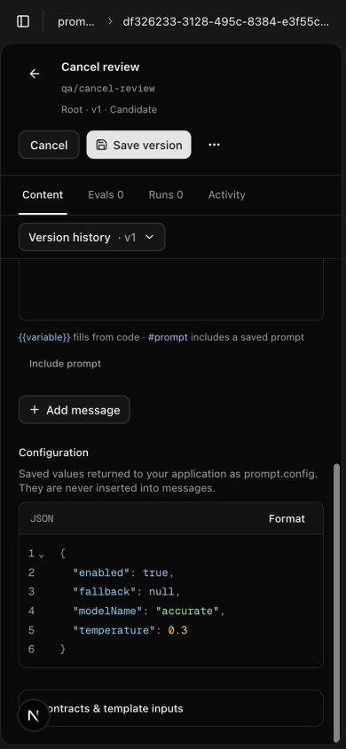

### Prompt actions and drawer polish (2026-10-09)

Each prompt row now has an unpinned actions menu and centered selection checkbox.
On narrow screens, a compact left rail opens the category tree inside the library body, below its header.
Category navigation, Escape dismissal, focus return and opening the category modal
are covered at tablet and mobile widths.
The sidebar reads **Prompt Management → Prompts**. Detail headers use two compact
lines, and every tab shares the same container-responsive version history.
Rename, move and code helper use platform dialogs, from either a row or a detail.
Archive/restore (including bulk actions), group removal/deletion, category deletion,
promotion/rollback and policy changes require explicit confirmation. Category deletion
still requires selecting a surviving destination. Escape/Cancel preserve data;
server rejection remains visible in the dialog. Confirmation defaults to Cancel.

Prompt loading routes now use the same hosted drawer as resolved content. The
new browser regression fails against the prior production build because it detects
an extra floating loading frame; it passes with the shared lifecycle. Coverage
checks one mounted surface, retained library, close/reopen, browser history,
modal lifecycle, blocked accidental writes, table geometry and responsive layouts.
Action menus avoid the modal-menu/dialog pointer-lock race. Menus that launch
dialogs unmount immediately on selection, so their outgoing interaction layer
cannot dismiss a menu reopened quickly after Cancel or Escape. Client-only
prompt query state updates synchronously, preventing an older transition from
briefly reopening the dismissed dialog and stealing focus from the new menu. Version saving waits
for its URL update before closing the diff, preserving the selected version on
an immediate reload.

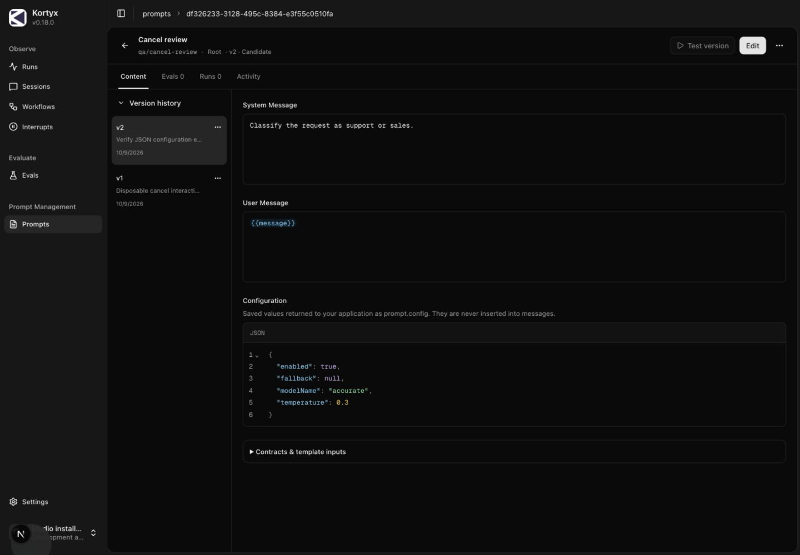

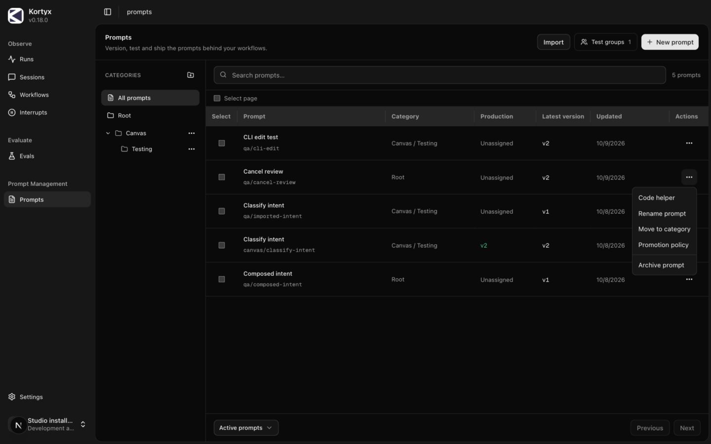

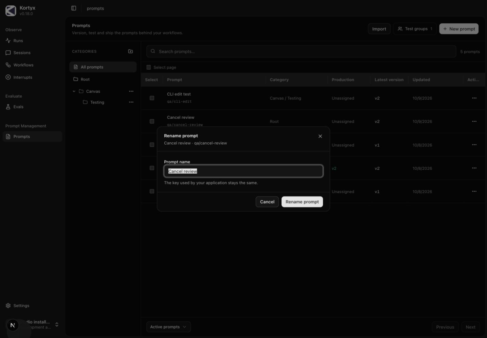

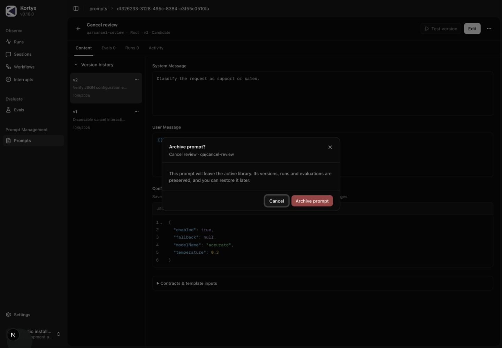

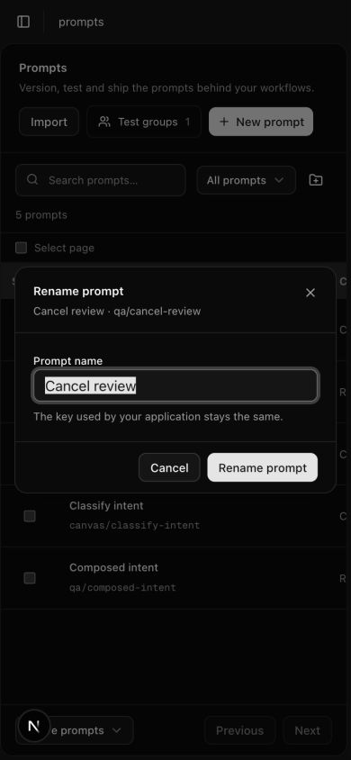

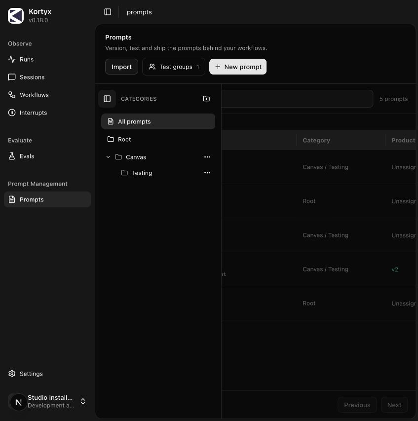

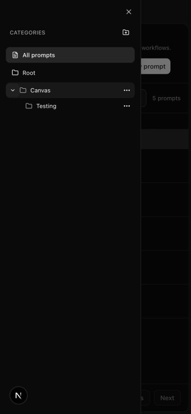

### Live versions, manual tags and expanded history (2026-10-09)

Prompt releases now use a reserved **live** tag. Saving a candidate leaves it
unchanged; promotion and rollback move it to the chosen immutable version.
Optional tags are assigned and removed independently, allowing applications to
choose their own staging/development conventions. The SDK defaults to live and
supports an explicit tag; execution environments still enforce authentication
and telemetry scope. Migration `0010_prompt_live_tags.sql` preserves existing
named assignments, seeds live from production and audits consolidated policies.

**Make this live** is first in each version menu. Its platform modal says
**Promote version** or **Roll back version** according to the current live
version, with no environment selector. Tag reassignment/removal requires
confirmation. The CLI supports tag/untag with revision checks; transfer imports
remain candidates without copying release pointers.

Reproduced version history disappearing when an inspector reduced an expanded
page's available width. The sidebar now remains visible beside the inspector
at desktop widths; narrow surfaces retain an accessible version picker. Reviewed
the actual UI at 1440×1000 and 390×844 and restored the browser viewport.

Final production drawer/prompt/responsive E2E: **48/48 passed**. Development had
47 passing checks and one outdated restore-copy assertion; its six-check focused
rerun passed. A subsequent full development run caught an older inspector test
requiring a dropdown where the retained sidebar is now visible. Its assertion now
accepts the responsive history control while retaining spacing and repeated-close
checks; both inspector-history scenarios passed in a focused rerun. New regressions cover expanded
history and the complete tag → promote → rollback → untag lifecycle, including
SDK resolution and isolation of manual tags from live.

Studio **252 tests**, SDK **20 tests**, focused CLI **5 tests**, API prompt and
OpenAPI checks, PostgreSQL prompt integration and independent destination
transfer passed. Affected-package type checking passed **34 tasks**; Studio
production build, API/CLI/dependency builds, repository lint, Drizzle schema
check and whitespace validation passed. Fresh native migrations passed.

A real built-CLI smoke test created a disposable prompt, assigned staging,
promoted live, removed staging and read back the unchanged live pointer. The
restarted example app served v2 with its exact version/hash in generation
telemetry. A fresh CLI candidate evaluation (`6d0881e7-ddc8-433f-939a-992b26a68521`)
passed both cases of `intent-regression` against v2 with a frozen live baseline.
The example uses a deterministic provider to verify integration behavior.

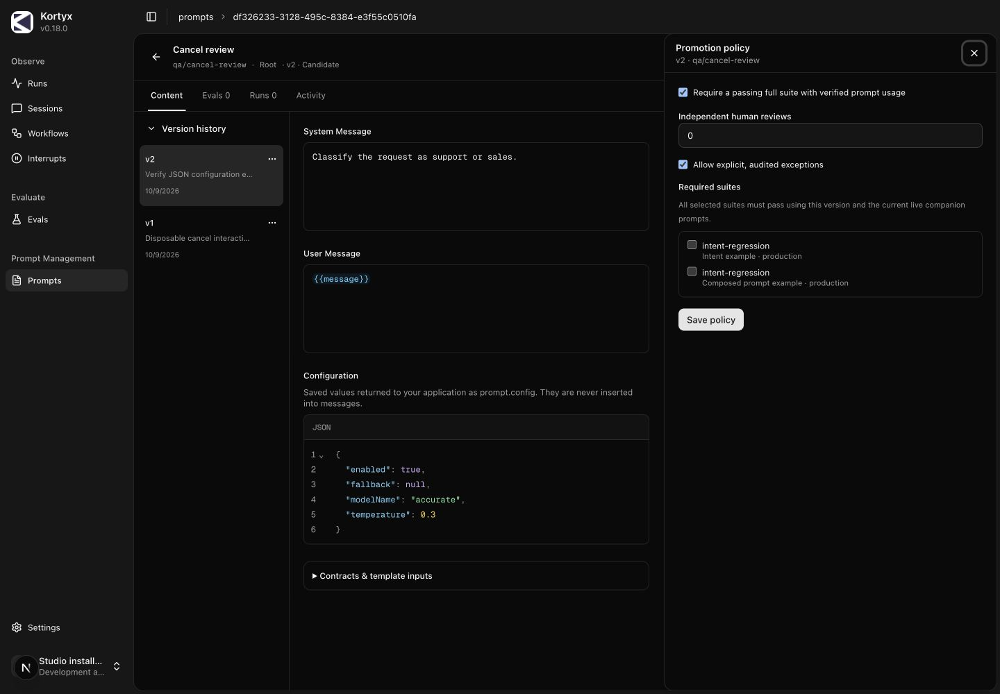

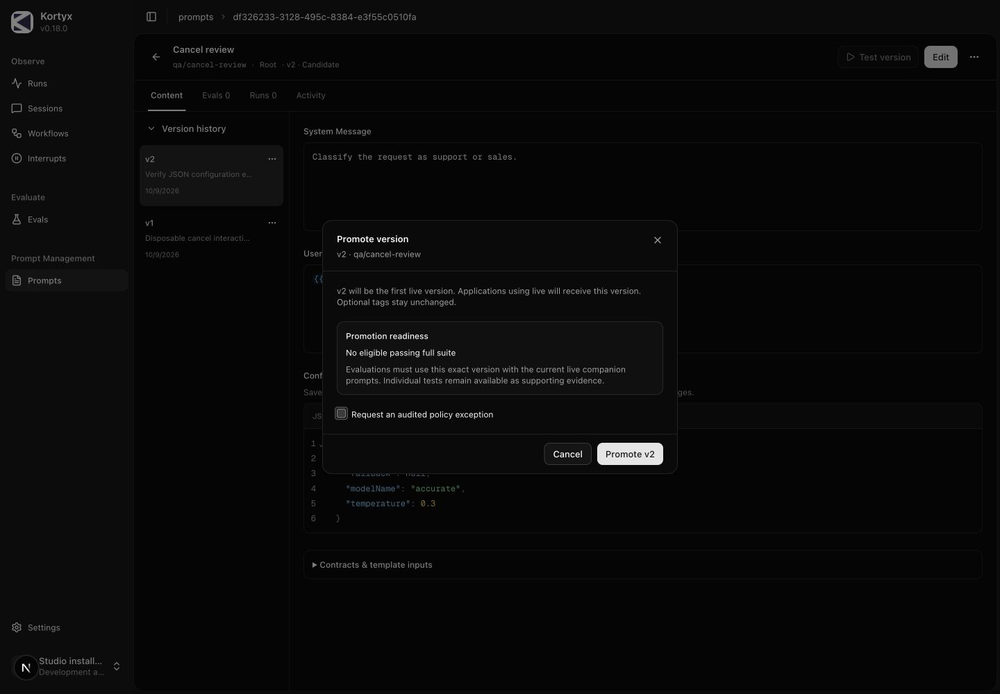

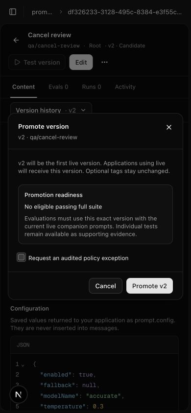

The focused inspector-history rerun passed in both development and production
(four checks each including fixture setup/cleanup). CI identified an uncovered
CLI rejection when a tag assignment omits its version; the added test verifies
rejection before any request. Full CLI coverage now passes with 259 tests and
100% line coverage, preserving the existing gate.

### Single promotion confirmation (2026-10-09)

Promotion and rollback now submit directly from their existing release modal.
The redundant second confirmation is removed. Cancel receives initial focus;
closing the modal does not write. Unmet evaluation/review requirements appear
before submission, and the action remains disabled until they are satisfied or
a permitted exception includes a reason of at least 10 characters. The exception
field exposes this minimum and its current length, and editing clears stale
server errors. Server rejections remain in this one dialog with the reason intact.
The project policy and API enforcement are unchanged.

The cancellation regression also reproduced the version menu closing immediately
after reopening. Version menus now finish their dismissal before handing focus
to a dialog, matching the existing prompt asset actions.

Reviewed the actual modal at 1440×1000 and 390×844, including short/valid reasons
and a visible footer. Restored the viewport and canceled without changing the
user's live assignment. Development promotion/cancellation/conflict/rollback
checks passed (four including setup/cleanup). Studio's 252 unit tests, typecheck,
production build, lint and whitespace checks passed.

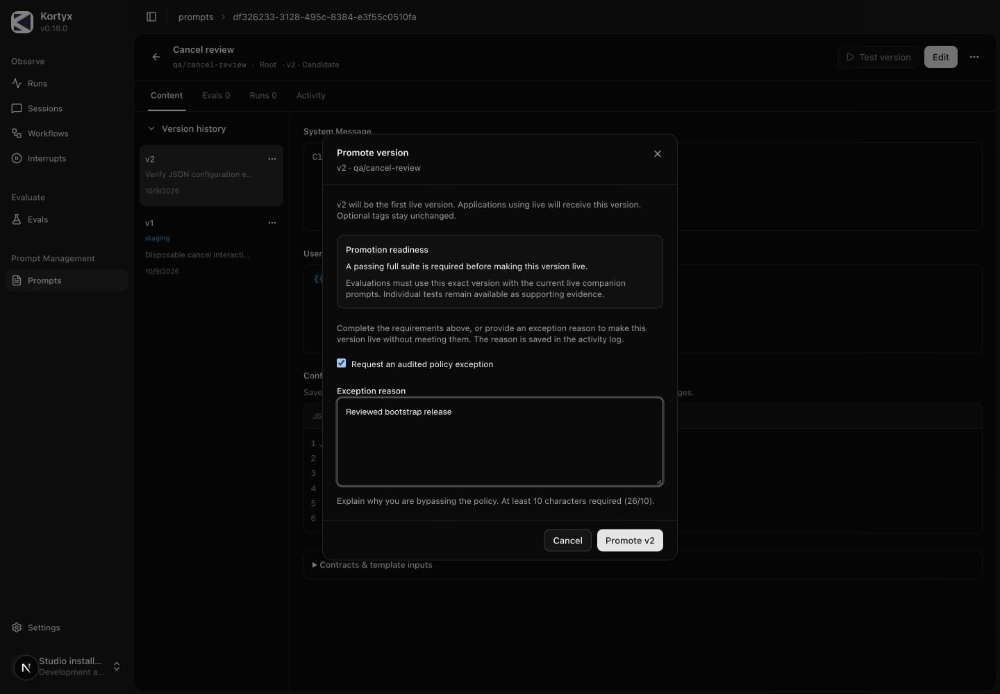

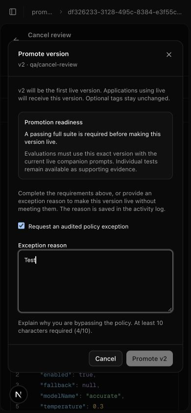

The final production prompt/drawer/responsive suite passed **48/48 checks**.

### Prompt-specific policy modal (2026-10-10)

Promotion policies now belong to a prompt and apply to all of its versions.
Reads, updates, optimistic revisions, promotion enforcement and audit records
use the prompt ID within the authenticated project. Migration
`0011_prompt_scoped_policies.sql` copies the previous project policy to each
existing prompt, preserving effective requirements and revisions. Original rows
are retained in migration audit records, including projects without prompts.
New prompts receive the standard defaults.

Policy actions from the library open one platform modal without opening a prompt
drawer or navigating away from the list. Detail actions use the same modal.
Save policy is the one explicit submission; Cancel/Escape does not write.
The modal stays mounted through loading so keyboard focus returns to its trigger.
Existing review inspectors continue to cover drawer layout, history and keyboard
ownership regressions.

Database regression checks cover independent reads/writes, promotion checks,
new-prompt defaults, stale revisions, cross-project rejection and audit isolation.
The migration regression verifies preserved settings, native replay and cascading
cleanup. API tests cover required IDs, permissions, missing prompts and conflicts.
Vitest uses the native PromptError module so API error classification matches the
production build. All of these focused checks pass, as do 252 Studio unit tests,
affected-package typechecks, the production build and Drizzle consistency check.

Browser coverage saves different policies for two disposable prompts and verifies
both persist independently. It also checks table navigation, Back/Forward,
cancellation and 768/390px modal geometry. Manual desktop/mobile review at
1440×1000 and 390×844 confirms the footer fits; opening from a detail drawer and
pressing Escape preserves that drawer. User prompt settings were not changed by
manual testing; the migration preserved their effective policies.

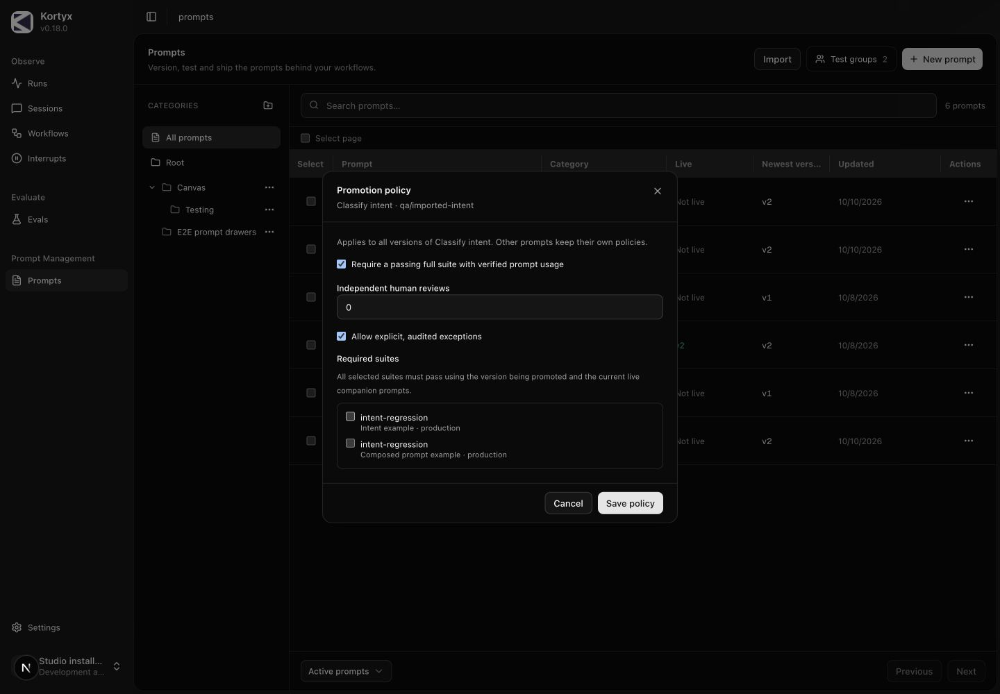

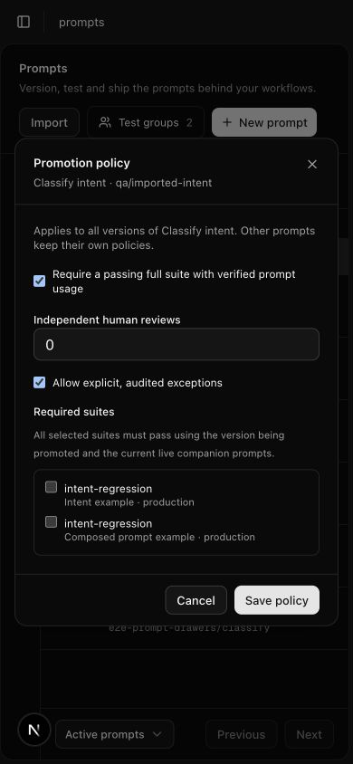

Production drawer/prompt/responsive validation passed 48 checks; one prompt
composition fixture request failed with `ECONNRESET` before UI interaction.
The final production rebuild and focused rerun passed all six checks, covering
that composition case, policy independence, trigger focus restoration from the
list and drawer, cancellation, promotion and rollback. API unit checks also
passed (97 tests; database-dependent suites are run separately as noted above).

### Unified prompt drawer header (2026-10-10)

Prompt details use the same 64px header in drawers, expanded drawers and direct
routes. The drawer shell supports an owned header so prompt details no longer
stack a generic title bar above a separate action bar. Loading uses the same
header height and controls. The leading Expand control becomes Back after
expansion; drawer actions sit immediately before Close. Narrow containers move
Test version and Cancel editing into the existing action menu. Edit/Save remain
visible, and saving keeps its full accessible label when its text shortens.

The history picker shares the 45px tabs row on narrow surfaces. Wide surfaces
retain the history sidebar. The responsive breakpoint uses the prompt body’s
width, including space reserved for inspectors. Expanded platform drawers remove
their shadow as well as their backdrop; nested expanded Session/Run ancestors
are covered too.

Added browser regression coverage verifies one mounted header through expansion,
header/tab geometry, action ordering, overflow access, mobile editing/cancel,
Back navigation, and exact absence of expanded drawer shadows. Existing dirty
and in-flight draft cancellation tests now exercise the overflow action. Studio’s
252 unit tests, typecheck, production build and lint checks pass. The final
production drawer-stack, prompt and responsive E2E run passed all 50 checks
(2.8 minutes). Manual review
covers 1440×1000 desktop and 390×844 mobile, then restores the viewport. No prompt
content or release settings were changed during manual review.

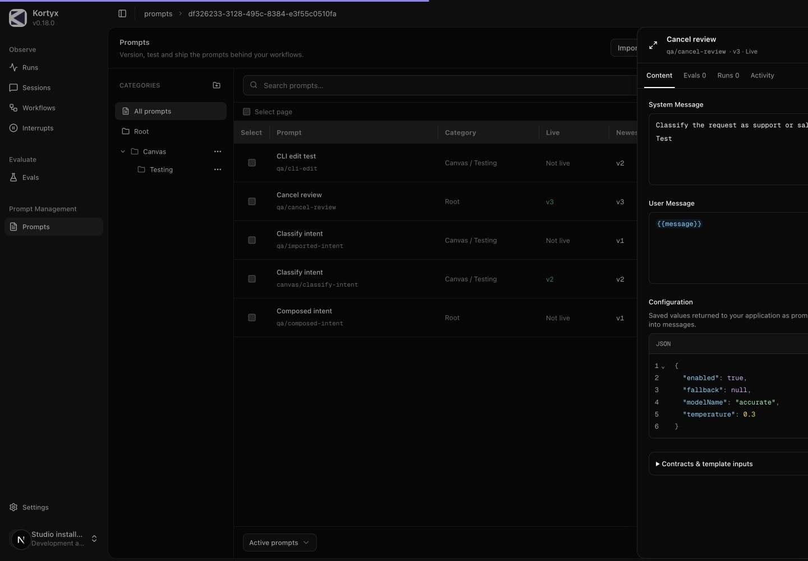

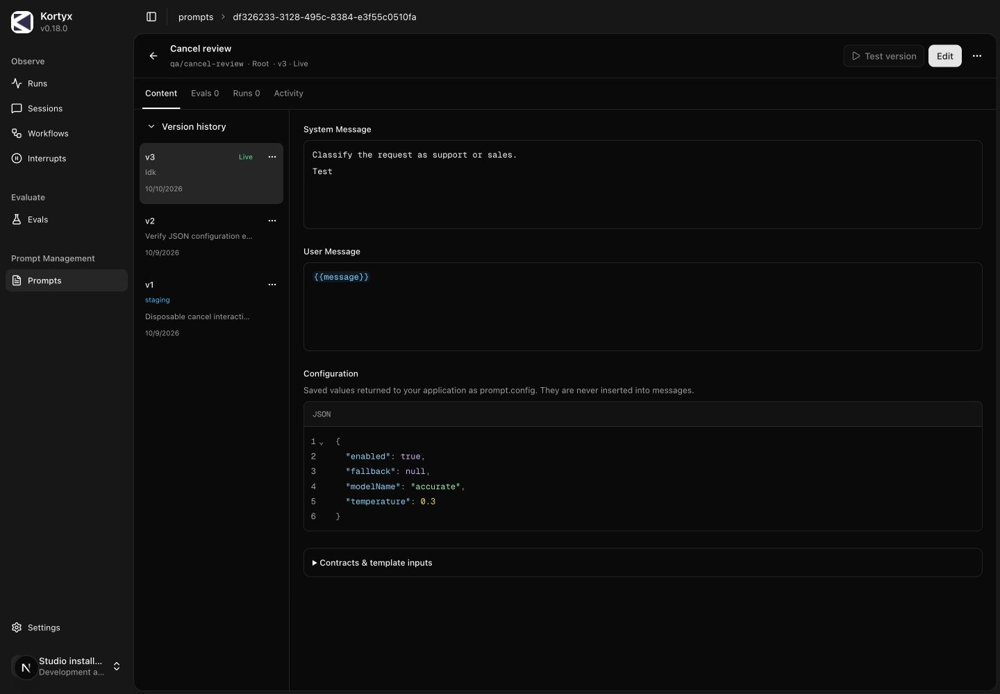

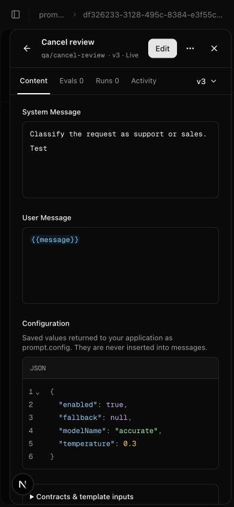

### Saved version reviews (2026-10-10)

The version review form is a platform modal, with Cancel and Submit review in
its footer. Reviews are visible in a dedicated Reviews tab for the selected
version, including reviewer, timestamp, multiline note and independent-review
status. The tab includes an empty state and a direct review action. Submitting
opens the reviewed version’s tab without refreshing away its intercepted drawer.
Re-submitting by the same reviewer updates the existing note.

Browser coverage checks modal dismissal, required note, persistence after reload,
version isolation, updates without duplication, preserved drawer presentation,
and the mobile modal footer. Existing inspector-navigation regressions now use
the test-group inspector, since reviewing no longer opens an inspector.

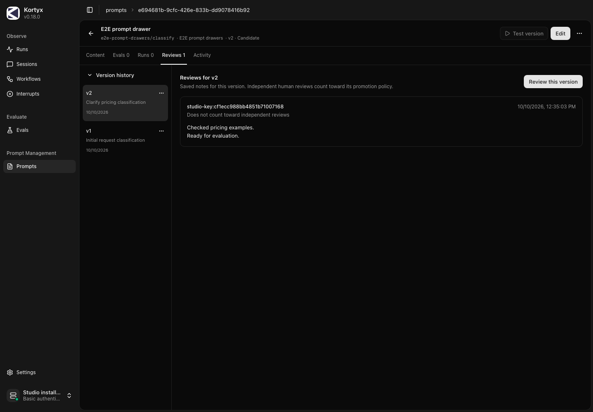

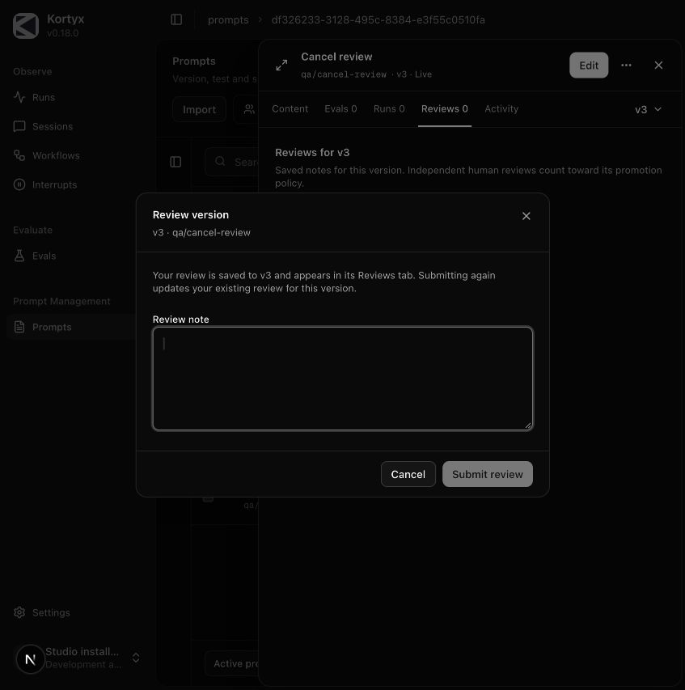

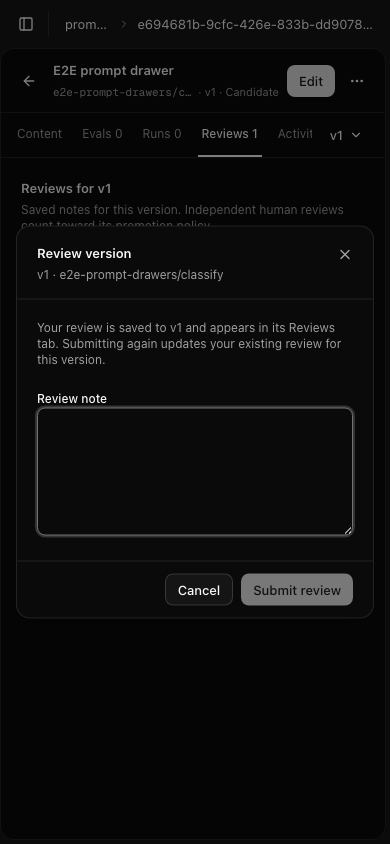

Validation: production build, typecheck, lint and whitespace checks pass. The
broad prompt run passed 29 checks; its new review test reloaded before nuqs
committed the closing URL. After explicitly awaiting that URL change, the focused
production review run passed all three checks (including setup and cleanup).
Desktop and mobile screenshots were inspected; mobile tabs stay on one line.

### New versions and persistent drafts (2026-10-10)

Saved versions are read-only. **+ New version** fetches and clones the newest
saved content, including configuration, schemas and dependencies, even when an
older version is selected. **Open draft** resumes an existing draft. The Draft
entry stays in version history until saved or explicitly deleted; the compact
history menu exposes the same entry. Navigation among versions and tabs keeps
the editor mounted, including invalid JSON text. Valid changes flush before
version navigation and when closing the prompt. **Delete draft** always requires
confirmation and retains the revision check against concurrent changes.

Save review compares against the draft's recorded base, and the same base,
content hash and draft revision are submitted when creating the immutable
version. JSON key order is canonicalized for the diff, avoiding false changes
from formatting. TipTap read-only changes no longer emit content-change events.
Browser Back after saving cannot recreate a draft through a stale edit URL.

The new regression starts on v1 without configuration, creates a draft from v2
with configuration, navigates through both versions and Reviews, leaves and
reopens the prompt, exercises the mobile history picker, then saves v3. It checks
the exact diff, submitted configuration, persisted configuration, unchanged v1
and removed draft. Existing clean, dirty, invalid and in-flight draft deletion
checks now exercise the new workflow.

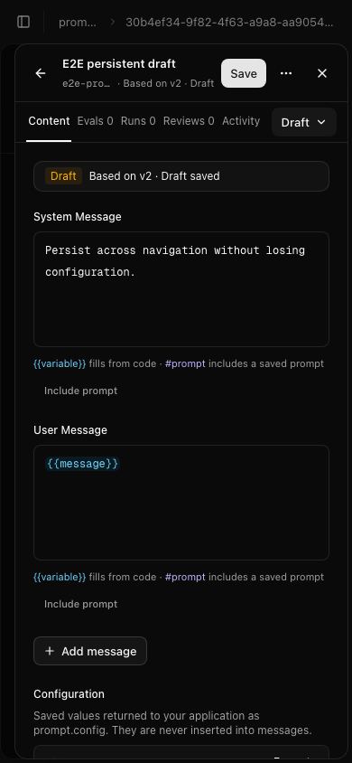

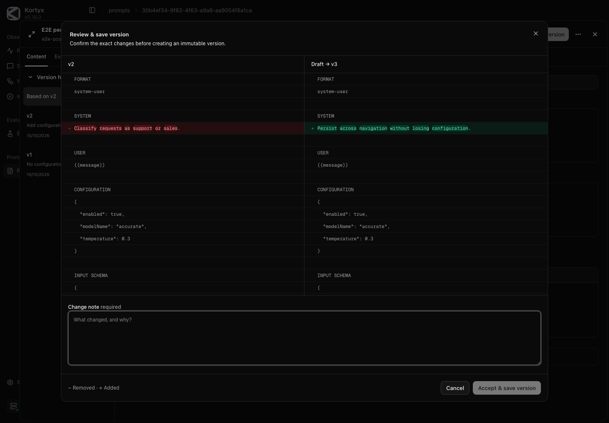

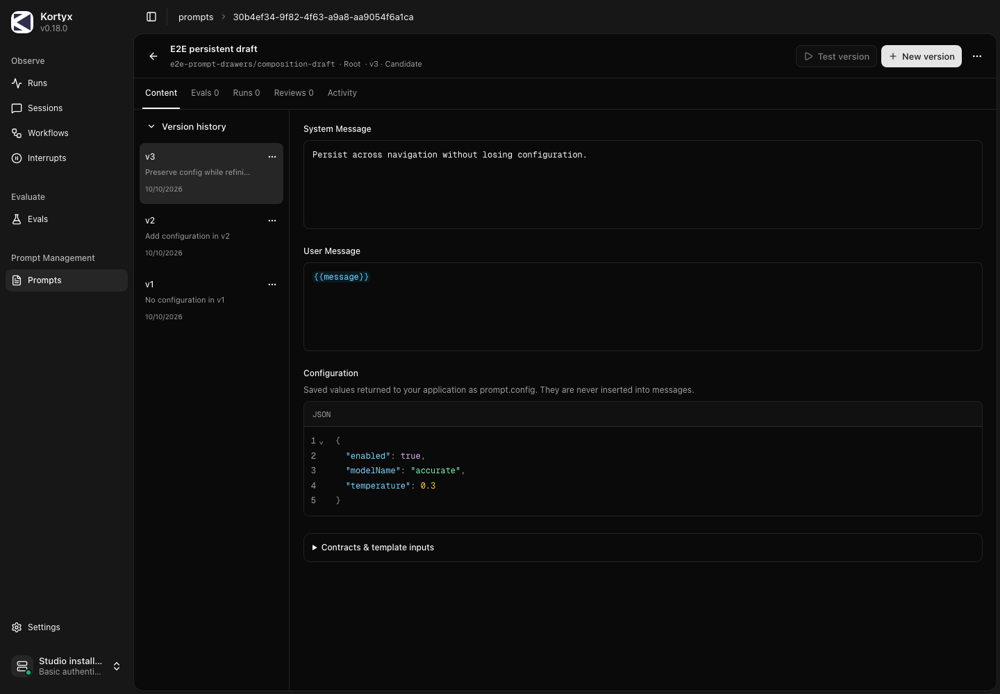

Validation: 252 Studio unit tests, typecheck, production build and whitespace
checks pass; lint has no errors (existing warnings remain). The production
prompt suite passed 30 checks; its new regression initially exercised
CodeMirror's native wrap-selection shortcut by entering a lone brace. With an
explicit incomplete JSON object instead, the focused production regression
passed all three checks (including setup/cleanup). The complete new-version
flow, invalid JSON retention, navigation, exact diff and persisted configuration
are verified. Desktop/mobile screenshots above were inspected.

### Saves and promotion without route refreshes (2026-10-10)

Prompt mutations used to fetch fresh data and then call `router.refresh()`,
requesting another RSC route payload while their modal or inspector closed.
The new continuity regression reproduces that behavior against the prior
production build.

Initial page reads remain in async server components through the existing
Result-returning API functions. Feature-local SWR queries retain those initial
snapshots and own subsequent revalidation, deduplication and shared library
updates. Query keys include project scope and library filters; cached reads
carry their originating scope even if the browser has navigated elsewhere.
The backend remains the authorization boundary. No prompt mutation refreshes
the route. Draft editor state and revision checks remain local and separate
from the server snapshots.

Browser tests observe every animation frame and DOM removal during delayed
rename, policy, version-save and live-promotion responses. They assert the same
drawer, header and underlying table remain mounted and visible, with no new
navigation/RSC requests (normal link prefetch is excluded). They also verify
that the library shows the new name/live version without a reload, a failed
rename keeps the entered value for retry, and group creation/rename preserve
both the group drawer and its parent library.

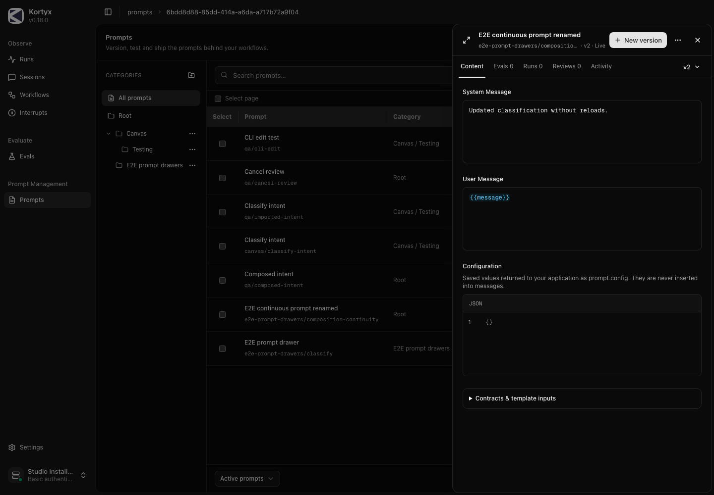

Validation: all 54 production prompt, drawer-stack and responsive checks pass.
The final pagination follow-up preserves loaded immutable history during
background revalidation; continuity and draft-persistence checks were rerun
against that production build. Studio's 252 existing unit tests plus two new
scope regressions pass, as do the production build, typecheck and whitespace
checks. Lint has no errors (existing warnings remain). Studio on port 6341
remains available.
