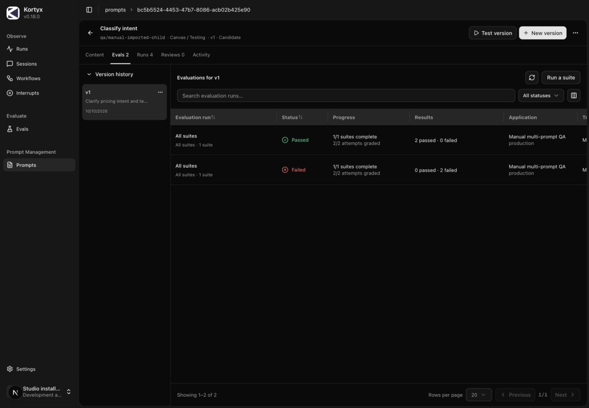
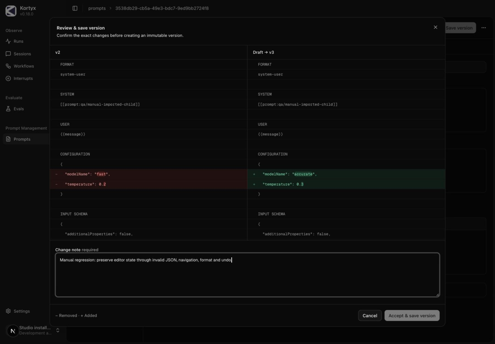
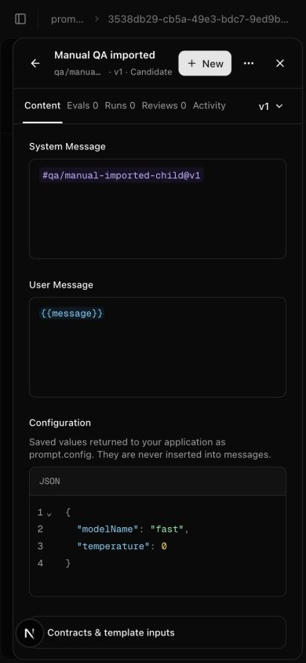

# Prompt management manual E2E — 2026-10-10

## Verdict

The prompt-management flows tested below pass after two editor fixes. **The PR is not ready to ship while the existing CI failures remain unresolved.** At the start of this pass, PR #288 at `35342a9f` had a failing tool-observability browser test and API container security scan. These are separate from the prompt regressions exercised here.

- [Tool-observability failure](https://github.com/kortyx-io/kortyx/actions/runs/38046849061/job/114198115923): the first attempt did not open its expected Run drawer; the retry accumulated two tool denials where the fixture expected one. This needs investigation, not an assumption that it is harmless flakiness.
- [API image security failure](https://github.com/kortyx-io/kortyx/actions/runs/38046849061/job/114198002575): Trivy reported HIGH `CVE-2026-78669` in Docker Compose's bundled `golang.org/x/net` v0.58.0, with v0.60.0 listed as fixed. No finding was suppressed during this pass.

## Setup and scope

Manual interaction used the real Studio browser UI at `localhost:6341`, the API on `6441`, PostgreSQL, and `examples/kortyx-prompts/src/server.ts`. A temporary copy changed the prompt key to `qa/manual-instructions` to avoid another prompt's unfinished draft. It ran on port `6546`. A second copy on `6548` registered two prompt definitions and executed two `usePrompt`/`useReason` calls in one workflow.

The example's deterministic provider and app judge exercised SDK resolution, execution, prompt receipts, suite transport, and Studio presentation. **This does not measure a paid model's semantic quality.** No live model account was used. Cross-deployment CLI transfer was verified in the earlier report; this pass rechecked CLI export and Studio remapped import within this deployment, not a second deployment.

Manual visual review covered dark and light themes at 1440×1000, 768×1024, and 390×844 in the in-app browser. The original System theme and viewport were restored. Supplementary automated regressions ran against an actual production Studio build on port 6343. The browser's security boundary blocked manual navigation to that basic-auth server; it was not bypassed. This is not a Safari/Firefox certification.

## Manual results

| Area | Observed result |
| --- | --- |
| Create and version | Created system/user content; saved v2 with configuration; required change note and exact side-by-side diff worked. |
| Persistent draft | New version cloned the newest saved content even while viewing v1. Configuration and invalid JSON survived history navigation. |
| JSON editor | Syntax colors, valid/invalid state, formatting, native undo/redo, exact configuration diff, save and read-back passed after the fixes below. |
| Composition | Native prompt picker inserted a reference to a pinned dependency. Saving v3 preserved its version/hash; the composed suite passed. |
| Single-case evaluation | One selected sales case passed. It appeared as partial evidence and did not satisfy the full-suite promotion requirement. |
| Group/full suite | Launched a full suite from a named group. Groups selected prompt versions without owning the suite. |
| Multiple prompts | Two exact candidate versions were used by one workflow. Both prompts show the successful and failed evaluations with verified usage. |
| Live and rollback | Full-suite evidence allowed promotion in one modal. A normal application request resolved the live version and appeared in Runs. Promoting v3 then rolling back to v2 left optional staging=v3 unchanged. |
| Reviews and policies | Saved review appeared on the version's Reviews tab. Shared Studio credentials correctly did not count as an independent human review. Changing imported prompt policy did not alter source prompt policy. |
| Import/export | Exported composed v3 with its dependency, uploaded the bundle, remapped both keys, inspected the plan and applied it. Destination hashes verified and live assignments were not copied. |
| CLI | Read, diff, export, validate, update and repeat-with-same-idempotency-key passed. Studio showed CLI v2 with temperature 0.2; retry returned the same v2/hash. |
| Library actions | Row rename and move modals did not open the prompt detail. Archive/restore confirmations worked, including on mobile. |
| Categories | Created Manual QA/Shipping using slash nesting; moved the imported prompt there. Narrow category navigation opened within the page body. |
| Drawers/navigation | Checked compact header, tabs/history, expand/collapse, nested eval inspection and browser Back. Supplementary tests verify frame continuity and no route remount during saves/promotion. |
| Responsive presentation | Reviewed full-area Runs/Evals tables, mobile menus/modals, tablet drawer, light theme, JSON colors and variable highlights. |

The initial two-call fixture evaluation failed because the original judge expected one label but observed `supportsupport` / `salessales`. Studio correctly exposed this supporting evidence. The two-call fixture judge was then changed to require exactly two expected labels; its full suite passed. The failed result remains visible alongside the successful result.

## Defects fixed during this pass

1. Invalid JSON could still show **Draft saved** after an earlier autosave completed. The status now explicitly says **Invalid fields · changes are not saved**, and Save remains disabled.
2. Controlled JSON replacements called the editor's `onChange` again. Manual navigation/editing exposed React maximum-update-depth errors. CodeMirror now marks externally supplied transactions and does not echo them as user edits. Unchanged validity also retains its existing state. Formatting remains undoable.

Retested invalid → valid JSON, switching saved versions and draft, formatting, undo/redo, save diff, and saved v3. No new browser warnings or errors appeared during the post-fix checks. The regression tests now reject console/page errors for JSON editing and persistent-draft navigation and assert the invalid-draft status.

## Verification

- Production Studio build: passed.
- Studio type checking: passed.
- Studio unit tests: **254 passed across 46 files**.
- Production prompt/drawer/responsive browser suite: **55 passed**, including fixture setup/cleanup.
- Biome on changed code: passed with existing warnings; no errors.
- `git diff --check`: passed.

The 55 browser checks cover `prompt-drawers.spec.ts`, `detail-drawer-stack.spec.ts`, and `responsive-details.spec.ts`. They supplement the manual results rather than replace them. Repository-wide CI status must still become green before release.

## Retained local fixtures

The original Studio remains running on 6341. The QA examples and data remain available for inspection; no existing user prompt or draft was discarded.

| Evidence | Identifier |
| --- | --- |
| Source prompt | `393613f1-0ab7-47fc-8da9-c497b5afa086` (`qa/manual-instructions`, live v2, staging v3) |
| Imported prompt | `3538db29-cb5a-49e3-bdc7-9ed9bb2724f8` (`qa/manual-imported`, saved v3, not live) |
| Imported companion | `bc5b5524-4453-47b7-8086-acb02b425e90` (`qa/manual-imported-child`, v1, not live) |
| Test group | `4a6db152-185e-4ec9-87ab-7e44d415aeb3` (Manual shipping QA) |
| Single-case evaluation | `2f26805c-987e-4870-b022-20105047ae4d` — 1/1 passed |
| Full suite from group | `c19bfe95-51e3-49f9-80c3-0f22cc1a5a3d` — 2/2 passed |
| Composed v3 suite | `eb3f08fc-e7bf-4dc5-b95d-8d1373bcbd70` — 2/2 passed |
| Two-call fixture mismatch | `afd46d4b-ff58-4c92-a7a9-6fb34b25c423` — 0/2 passed, expected fixture mismatch |
| Two-prompt full suite | `df4da6c2-9d4b-4b69-8c9d-634f2031f810` — 2/2 passed |
| Ordinary live request | `run-b8b694a4-a8d4-49c9-959f-d685121fd2c5` — sales |

## Screenshots

Additional captures: [full suite](multi-prompt-suite.jpg), [review](review.jpg), [promotion](promoted.jpg), [live run](live-runs.jpg), [composition diff](composition-diff.jpg), [rollback](rollback.jpg), [verified import](import-verified.jpg), [mobile categories](mobile-categories.jpg), [tablet drawer](tablet-drawer.jpg), [invalid draft](invalid-draft.jpg), [light desktop](light-desktop.jpg), [saved configuration](saved-configuration.jpg).
