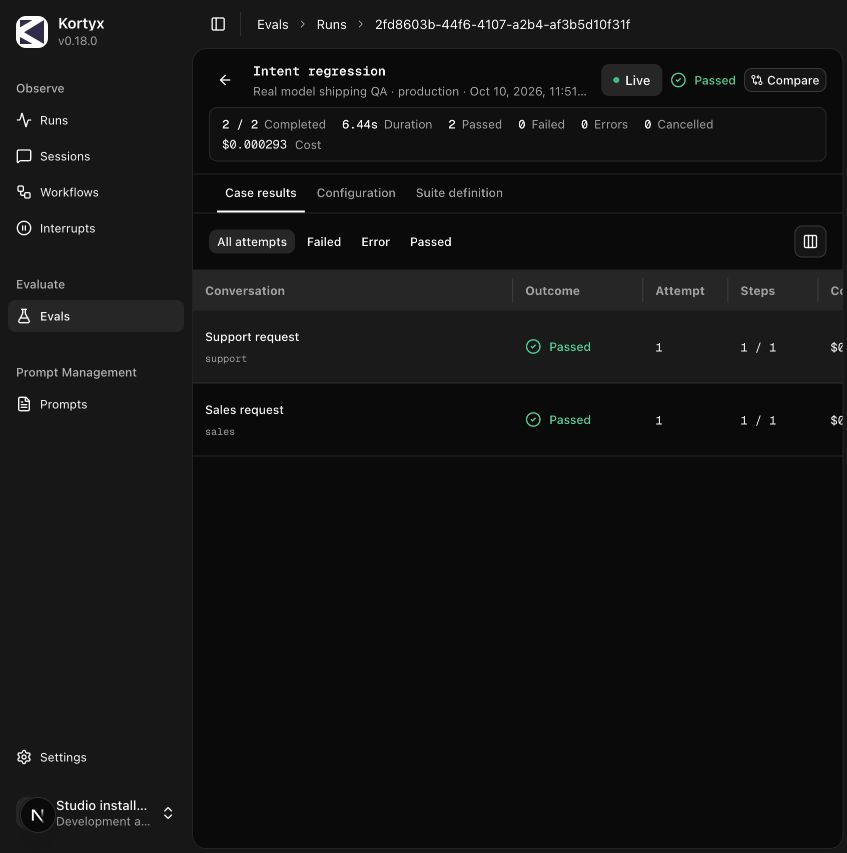
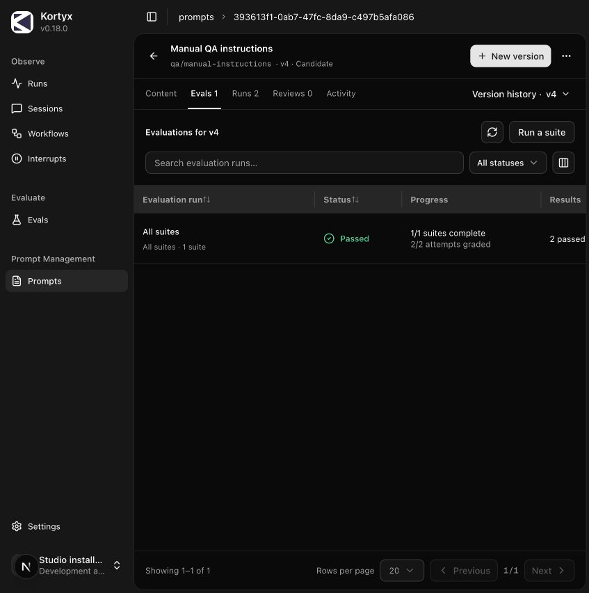
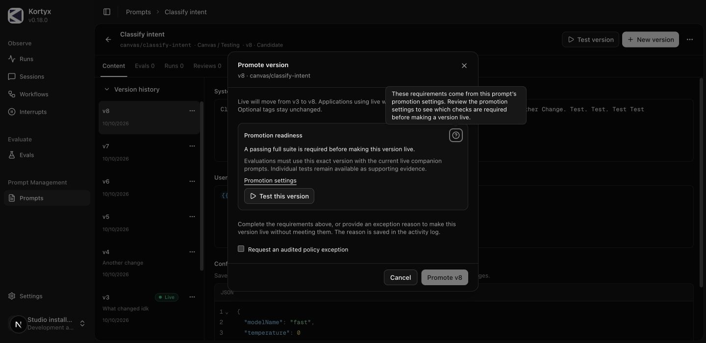
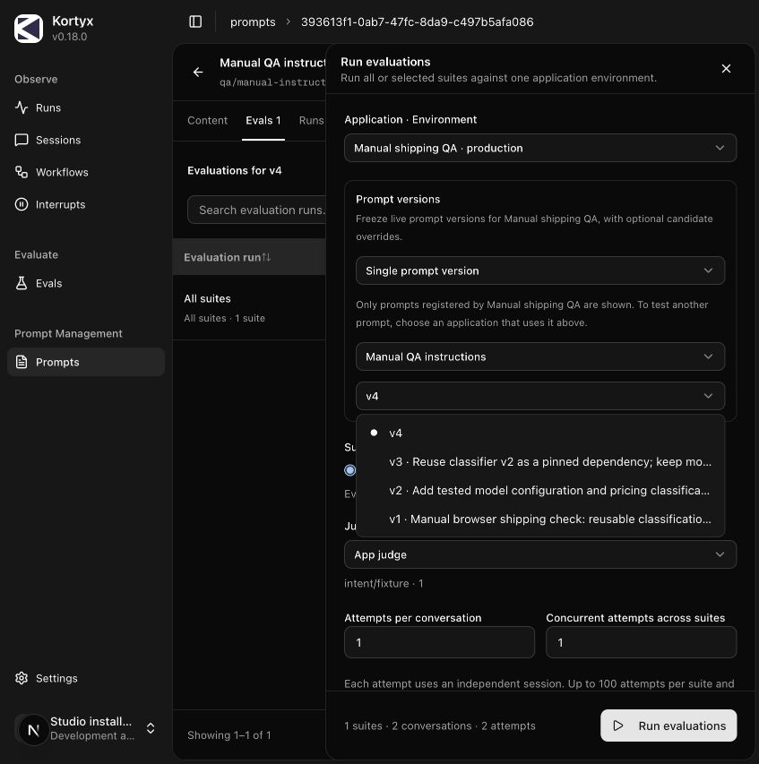
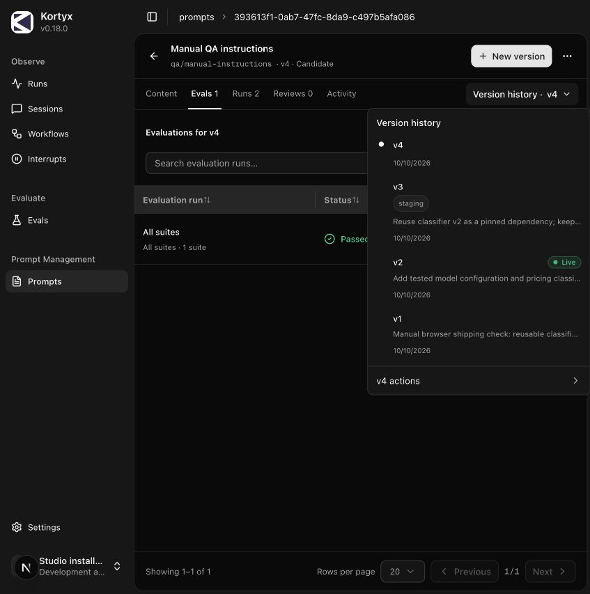

# Prompt management shipping follow-up — 2026-10-10

This follows the [full manual browser pass](../manual-20261010/README.md). The remaining CI defects were investigated and fixed; the real-model workflow and candidate evaluation were exercised through the local example and Studio. Final CI results are recorded on [PR #288](https://github.com/kortyx-io/kortyx/pull/288).

## Fixes

- The API image rebuilds pinned Compose v5.6.0 with Go 1.26.9 and `golang.org/x/net v0.60.0`, fixing the reported HIGH CVE-2026-78669 without a scan exception. The local Compose stage builds, module metadata confirms both patched versions, and `docker-compose version` succeeds.
- The tool-observability failure trace showed a cold dev compilation delaying the intercepted Run drawer beyond the assertion deadline. Wait for the exact Run drawer before asserting its contents. Each worker now has a unique workflow ID so retries and parallel invocations cannot share prior denial counts.
- Runs no longer invent input/output/reasoning/cache token counts from fixed percentages. The tooltip reports only the captured total, including zero; a regression test covers zero, known and unknown totals.
- The example's model-judge criteria now explicitly require an intent label. The prior phrase “Returns sales” was misread as requiring transaction data even though the workflow returned `sales`. The deterministic judge uses the same case-insensitive label contract.

## Real-model smoke

Used `examples/kortyx-prompts/src/server.ts` with a temporary QA prompt key and the repository OpenAI adapter instead of OpenRouter. Both the workflow and app judge used **openai/gpt-4o-mini**, using the existing local credential. No credential was copied into the repository. The example ran on port 6549, API on 6441 and Studio on 6341.

1. Two ordinary application requests against live v2 returned the expected Support/Sales labels. Studio attached both completed runs to v2 and showed actual model, duration, cost and totals of 37 and 38 tokens.
2. From Studio's Run evaluations drawer, selected the real-model application, a single prompt override of composed candidate v3, all suites and the app model judge. Live remained v2 throughout.
3. Initial evaluation `052907f6-6d97-4684-a70b-cd5e683818a6` had one pass and one failed judgment because of the ambiguous criterion. The case drawer exposed the judge's reasoning correctly. This result was retained.
4. After clarifying the criteria, evaluation **`19a3d9b5-392b-4e5f-b9ed-47d2140e5348`** completed **2/2 passed, zero failures/errors**, in 6.44 seconds. Workflow cost was $0.000014; judge cost $0.000279; total $0.000293.
5. Suite run **`2fd8603b-44f6-4107-a2b4-af3b5d10f31f`** showed both cases passing. The sales case's model assessment explicitly confirmed the label. The prompt's v3 Evals tab attached both real-model results with **Usage verified**. Candidate v3 includes a pinned prompt dependency, so this also exercised real-model composition and provenance.

## Local checks

- Studio unit suite: **255 passed** across 46 files.
- Studio TypeScript: passed.
- Tool-observability browser file repeated three times: **14 passed**, including setup/cleanup, no retries. Used the real API and dev Studio.
- Changed TypeScript files: Biome and whitespace checks passed.
- Example TypeScript: passed. Its two opt-in transport tests were skipped by the default invocation; the real application/browser flow above exercised the transport directly.
- Patched Compose stage: built and executable; final API image vulnerability scan remains enforced in CI.

## Follow-up: notes and prompt-local evaluation launch

- Change notes are optional by default. A prompt-specific policy can require them for future saves. Enforcement is shared by Studio, API and CLI; existing versions remain immutable. Migration `0012_prompt_change_notes.sql` adds the setting, defaulting to false.
- Launching from a prompt closes setup and selects that prompt's Evals tab, preserving its version and expanded/drawer presentation. Ordinary eval-page launches still navigate to the evaluation run.
- Unmet evaluation requirements in the promotion modal offer **Test this version**, preselecting the exact candidate. Exception reasons require non-whitespace content with no arbitrary character minimum.
- Manual browser verification saved QA v4 without a note, opened its promotion modal, launched the preselected candidate suite, and remained on `/prompts/393613f1-0ab7-47fc-8da9-c497b5afa086?v=4&tab=evals`. The suite passed 2/2 with verified usage; live remained v2.
- Focused browser regressions: 5 passed including setup/cleanup; assert no route requests or disappearing prompt surfaces after launch, optional/required note behavior, and short/blank exception validation.
- Database/policy plus fresh migration tests: 38 passed. Studio unit tests: 255 passed. CLI prompt tests: 5 passed.

## Follow-up: promotion help and evaluation picker

- Promotion readiness has a keyboard-accessible help icon on the right. Its tooltip explains the prompt-specific policy; clicking opens that prompt’s policy modal without stacking dialogs or reloading the prompt.
- Application · Environment precedes Prompt versions. The drawer explains that only prompts registered by the selected application can affect its evaluation.
- Prompt search lives inside the picker. Manual browser checks covered an empty result, search recovery, Arrow Down / Enter selection, and Escape closing only the menu.
- Long option labels truncate on one line at the trigger width and expose their full text with native `title` attributes. Versions without notes show only their version number.
- Focused promotion/navigation browser regressions: 4 passed, including setup/cleanup. Studio TypeScript passed.

- Live now uses a green chip with a green status dot in both history layouts, the prompt header, library and tag management. Optional tags use softer neutral chips, including compact history. Browser appearance and Studio typecheck verified.

